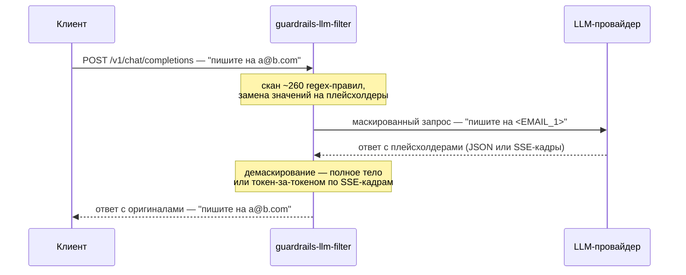
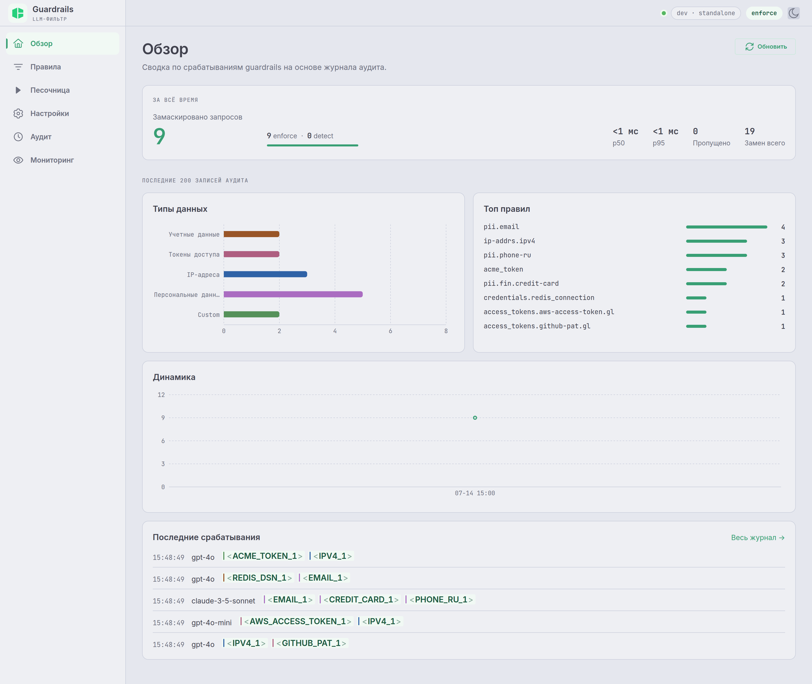
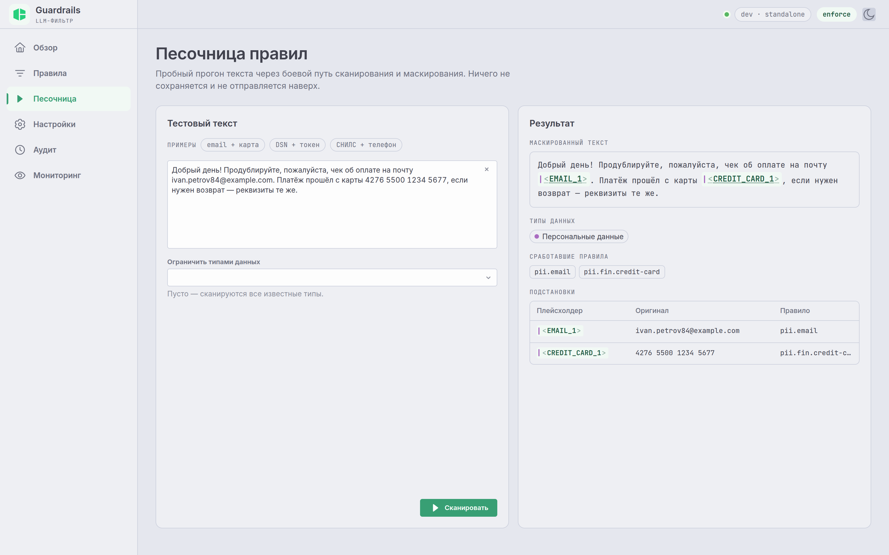
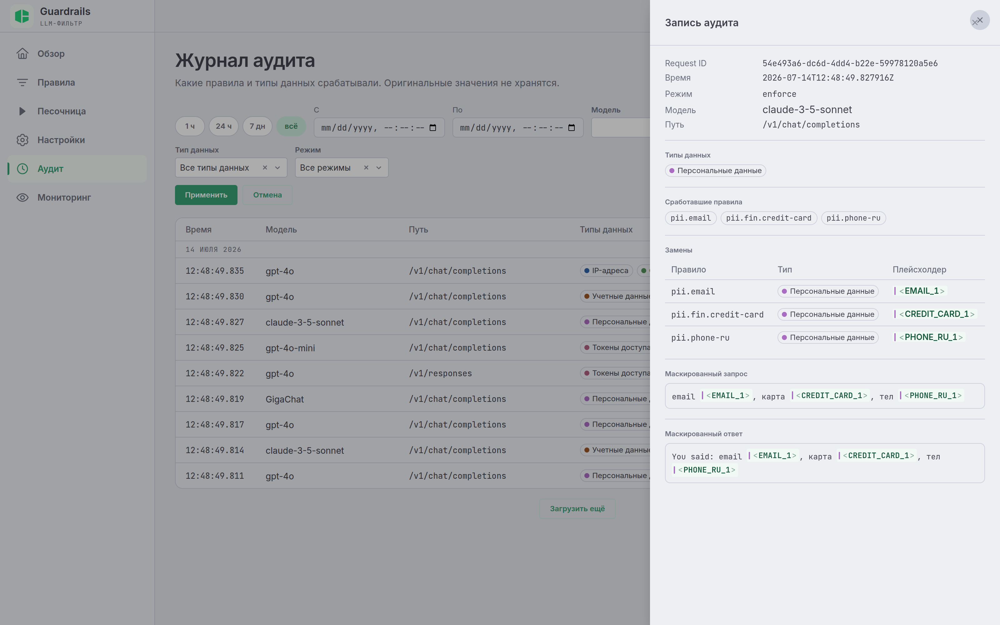
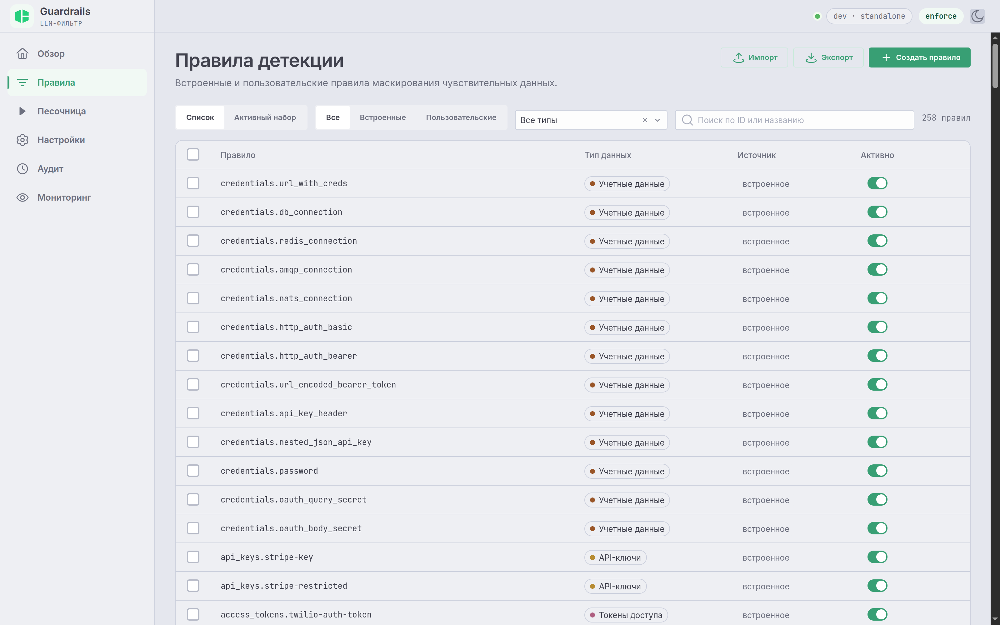
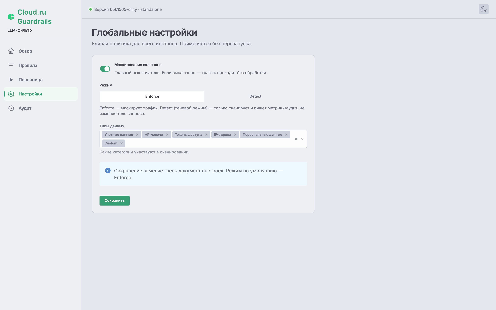
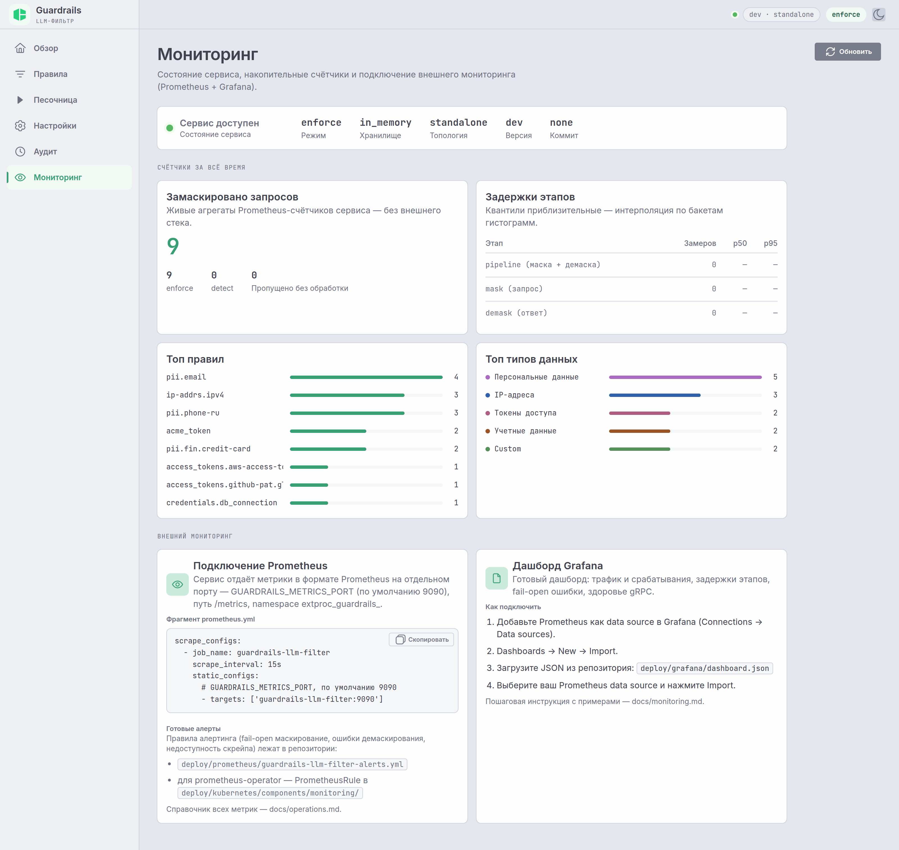
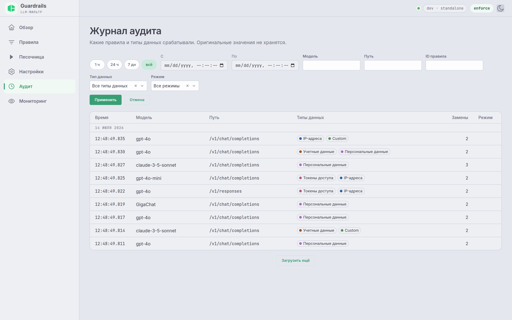
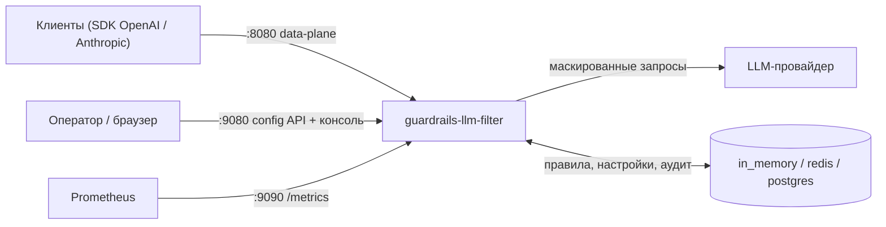

<div align="center">


# guardrails-llm-filter

**PII и секреты не должны попадать к LLM-провайдеру.**

Прозрачный прокси: модель видит плейсхолдеры, клиент — оригиналы.
В приложении меняется только base URL.

[](LICENSE)
[](go.mod)
[](CHANGELOG.md)
[](CONTRIBUTING.md)
[](https://cloud.ru)

[Быстрый старт](#быстрый-старт) · [Возможности](#возможности) · [Веб-консоль](#веб-консоль) · [Сравнение с альтернативами](#сравнение-с-альтернативами) · [Документация](#документация)

</div>

---

Клиенты обращаются к прокси вместо провайдера. По пути к модели ~260 встроенных
regex-правил заменяют найденные чувствительные значения плейсхолдерами вида
`<EMAIL_1>`, а в ответе — включая SSE-стриминг токен-за-токеном — возвращают
оригиналы. Модель никогда не видит чувствительные данные; клиент никогда не
видит плейсхолдеры.



<sub>Envoy или сайдкара в пути нет — сервис сам является data-plane. Родственный
проект [`guardrails-llm-filter-extproc`](https://github.com/cloud-ru-tech/guardrails-llm-filter-extproc)
упаковывает тот же движок как gRPC-сайдкар Envoy `ext_proc`.</sub>

## Возможности

- 🛡️ **~260 встроенных правил**: учётные данные, API-ключи, access-токены, IP-адреса,
  персональные данные (российские PII, карты, IBAN, СНИЛС/ИНН/ОГРН — с проверкой
  контрольных сумм).
- 🔄 **Оригиналы возвращаются в ответ автоматически** — включая потоковые ответы и
  аргументы вызова инструментов (tool-call). Клиент видит настоящие данные, модель —
  только заглушки.
- 🔌 **OpenAI и Anthropic из коробки**: `/v1/chat/completions`, `/v1/responses`,
  `/v1/messages` — JSON и стриминг.
- ⚡ **Микросекунды на data-path**: детекция — regex + валидаторы контрольных сумм,
  без ML-инференса и внешних вызовов ([сравнение с альтернативами](#сравнение-с-альтернативами)).
- 🟢 **Fail-open по замыслу**: любая внутренняя ошибка пропускает трафик, а не ломает его.
- 👁️ **Detect (shadow) режим**: оцените, что *было бы* замаскировано, не трогая трафик, и
  переключитесь на `enforce` через API без передеплоя.
- 🎛️ **Встроенная веб-консоль**: обзор, правила, песочница, настройки, журнал аудита
  и мониторинг.
- 📊 **Наблюдаемость**: метрики Prometheus, готовый дашборд Grafana
  ([пошаговое подключение](docs/monitoring/README.md)), аудит-трейл.

## Быстрый старт

Готовый образ: направьте его на вашего LLM-провайдера — и шлите запросы на `:8080`
вместо провайдера. В клиенте меняется только base URL:

```sh
docker run --rm -p 8080:8080 -p 9080:9080 \
  -e GUARDRAILS_UPSTREAM_BASE_URL=https://foundation-models.api.cloud.ru \
  ghcr.io/cloud-ru-tech/guardrails-llm-filter:latest

# в другом терминале — тот же запрос, что вы бы послали провайдеру, но другой хост:
curl -sS http://localhost:8080/v1/chat/completions \
  -H 'Content-Type: application/json' \
  -H "Authorization: Bearer $CLOUDRU_API_KEY" \
  -d '{"model":"ai-sage/GigaChat3-10B-A1.8B","messages":[{"role":"user","content":"email me at a@b.com"}]}'
```

Провайдер получает `<EMAIL_1>` вместо адреса; в ответе, который получаете вы, оригинал
восстановлен. Веб-консоль — на <http://localhost:9080>.

<details>
<summary>Сборка из исходников вместо образа</summary>

```sh
make build
GUARDRAILS_UPSTREAM_BASE_URL=https://foundation-models.api.cloud.ru \
  ./bin/guardrails-llm-filter
```

</details>

> Ключ `CLOUDRU_API_KEY` и список доступных моделей — в
> [документации Cloud.ru Foundation Models](https://cloud.ru/docs/foundation-models/ug/topics/quickstart).

### Запускаемое демо (реальный провайдер не нужен)

```sh
cd examples/quickstart
docker compose up --build      # guardrails-llm-filter + фейковый LLM, который отвечает эхом
bash demo.sh                   # шлёт промпты с выдуманными email и картой; показывает,
                               # что ушло провайдеру (замаскировано) и что вернулось клиенту
```

Демо включает аудит и сохранение маскированных текстов запроса/ответа — откройте консоль на
<http://localhost:9080> и посмотрите страницы «Обзор» и «Аудит» (скриншоты — ниже).

## Веб-консоль

Управление правилами, настройками и аудит-трейлом **вшито в бинарь** и отдаётся на `/` на
management-порту (`:9080`) — тот же образ, без отдельного веб-сервера и без CORS.

<div align="center">

### Обзор — сводка срабатываний по журналу аудита


</div>

| Песочница — прогон текста через боевой путь | Журнал аудита — деталь записи |
|:--:|:--:|
| [](docs/images/tester.png) | [](docs/images/audit-detail.png) |
| **Правила детекции** — 265 встроенных + пользовательские | **Настройки** — единая политика инстанса |
| [](docs/images/rules.png) | [](docs/images/settings.png) |
| **Мониторинг** — счётчики сервиса + подключение Prometheus/Grafana | **Журнал аудита** — что срабатывало и когда |
| [](docs/images/monitoring.png) | [](docs/images/audit.png) |

> Консоль включена по умолчанию (`GUARDRAILS_UI_ENABLED=false` отключает), делит границу
> доверия config API и работает **только внутри кластера** — никогда публичный ingress.
> Есть переключатель светлой/тёмной темы.

## Как это работает

Весь путь запроса проходит в одном обработчике на одной реплике: прочитать запрос клиента
→ замаскировать → переслать провайдеру → получить ответ и восстановить в нём оригиналы
(целиком, а для потоковых ответов — по мере поступления) → отдать клиенту. Запрос и ответ
на него обрабатываются вместе, поэтому таблица «заглушка → оригинал» просто хранится в
памяти процесса, пока идёт запрос. Отдельное хранилище для прохождения трафика не нужно.

- **Поддерживаемые API**: OpenAI `/v1/chat/completions`, `/v1/responses`, Anthropic
  `/v1/messages` — обычные и потоковые ответы, включая аргументы вызова инструментов.
  Пути сравниваются по окончанию, поэтому вложенные варианты (`/openai/v1/chat/completions`)
  работают сразу; свои пути задаются через `GUARDRAILS_PATHS`. Если тело запроса не удаётся
  разобрать, он проходит без маскирования (безопасное поведение при сбое) и увеличивает
  счётчик `extproc_guardrails_unsupported_body_schema_total`. Любой другой путь просто
  проксируется провайдеру без изменений.
- **Что делает сервис с находкой**: только заменяет значение на заглушку. Запросы он
  никогда не блокирует.

Полный разбор пути запроса, движок правил и устройство хранилища — в
[`docs/`](docs/README.md).

## Сравнение с альтернативами

Ниша `guardrails-llm-filter` — **двустороннее** маскирование как drop-in прокси:
клиент меняет только base URL, провайдер видит плейсхолдеры, клиент получает
оригиналы обратно — в том числе внутри SSE-стриминга токен-за-токеном. Большинство
инструментов в этой области делают одностороннюю редакцию («замазали и забыли»)
или требуют встраивания в код приложения. Состояние на июль 2026, по официальной
документации проектов:

| Возможность | **guardrails-<br/>llm-filter** | [LiteLLM](https://docs.litellm.ai/docs/proxy/guardrails/pii_masking_v2)<br/>+ Presidio | [Kong AI<br/>Gateway](https://docs.konghq.com/hub/kong-inc/ai-sanitizer/) | [Portkey](https://portkey.ai/docs/product/guardrails) | [NeMo<br/>Guardrails](https://github.com/NVIDIA-NeMo/Guardrails) | [LLM Guard](https://github.com/protectai/llm-guard) | [Presidio](https://microsoft.github.io/presidio/) | [Bedrock<br/>Guardrails](https://aws.amazon.com/bedrock/guardrails/) |
|---|:--:|:--:|:--:|:--:|:--:|:--:|:--:|:--:|
| Форм-фактор | прокси,<br/>один Go-бинарь | шлюз (Python)<br/>+ 2 контейнера | шлюз + отдельный<br/>PII-сервис | шлюз<br/>(TypeScript) | фреймворк<br/>(Python) | библиотека<br/>+ API | библиотека /<br/>REST-сервисы | managed-фича<br/>AWS |
| Drop-in прокси (меняется только base URL) | ✅ | ✅ | ✅ | ✅ | ⚠️ | ❌ | ❌ | ❌ |
| Маскирование запросов к LLM | ✅ | ✅ | ✅ | ✅ | ⚠️[^5] | ✅ | ✅ | ✅ |
| Восстановление оригиналов в ответе | ✅ | ⚠️[^1] | ⚠️[^3] | ❌[^4] | ❌ | ✅ | ⚠️[^7] | ❌ |
| Восстановление в SSE-стриме токен-за-токеном | ✅ | ⚠️ | ❌ | ❌ | ❌ | ❌ | ❌ | ❌ |
| Детекция секретов и ключей (не только PII) | ✅ | ⚠️[^8] | — | ⚠️[^9] | — | ✅ | — | ⚠️[^9] |
| Российские PII с контрольными суммами (СНИЛС/ИНН/ОГРН) | ✅ | — | — | — | — | — | — | — |
| Shadow-режим (скан и метрики без изменения трафика) | ✅ | ✅ | — | — | — | — | — | — |
| Веб-консоль управления из коробки | ✅ | ✅ | ⚠️[^10] | ⚠️[^11] | ❌ | ❌ | ❌ | ✅ |
| Без ML-инференса на data-path (микросекунды) | ✅ | ❌ | ❌ | ⚠️ | ❌ | ❌ | ❌ | ❌ |
| Self-hosted | ✅ | ✅ | ✅ | ✅ | ✅ | ✅ | ✅ | ❌ |
| Лицензия | Apache-2.0 | MIT[^2] | Enterprise | MIT | Apache-2.0 | MIT[^6] | MIT | проприетарно |

<sub>✅ заявлено в документации и работает из коробки · ⚠️ частично / с оговоркой
(см. сноску) · ❌ явно нет · «—» в документации не заявлено.</sub>

[^1]: `output_parse_pii` восстанавливает по карте вида `<PERSON>` — повторные
    сущности одного типа могут коллизировать; стриминг — частично.
[^2]: Ядро MIT, часть guardrail-функций — в платном enterprise-каталоге.
[^3]: `recover_redacted` восстанавливает только значения из запроса;
    response-фаза плагинов несовместима со стримингом.
[^4]: Документация Portkey: «redaction is irreversible by design».
[^5]: Маскирование label-плейсхолдерами (`[FIRST_NAME]`) через Presidio/GLiNER,
    без карты восстановления.
[^6]: Репозиторий архивирован в июле 2026 (после поглощения Protect AI компанией
    Palo Alto Networks).
[^7]: Деанонимизация только для оператора `encrypt` (AES) — расшифровка, а не
    восстановление плейсхолдеров.
[^8]: `hide_secrets` — в платном enterprise-каталоге.
[^9]: Через пользовательские regex-паттерны, готового каталога секретов нет.
[^10]: Kong Manager — в Enterprise-тире.
[^11]: Контрольная панель — в hosted-облаке Portkey; в self-hosted OSS-шлюзе
    консоли нет.

Отличия одним абзацем: детекция здесь — **regex + валидаторы контрольных сумм**
(Luhn, СНИЛС, ИНН, ОГРН, IBAN), поэтому data-path обходится без ML-моделей и
внешних вызовов; **~260 правил** включают каталог секретов, производный от
gitleaks; маскируются и **аргументы tool-call**; fail-open инвариант — никакая
внутренняя ошибка не блокирует трафик.

**Когда выбрать другое.** Нужен контекстный ML-NER для свободного текста на
многих языках — Presidio (или LiteLLM с ним). Нужен полновесный AI-шлюз
(маршрутизация, ключи, бюджеты, 100+ провайдеров) — LiteLLM или Portkey, PII там
будет попроще. Уже стоит Kong Enterprise — логично включить `ai-sanitizer`. Вся
инфраструктура в AWS Bedrock — Guardrails ближе всего. Нужны диалоговые рельсы и
защита от джейлбрейков, а не маскирование — NeMo Guardrails решает другую задачу.

## Конфигурация

Все переменные с префиксом `GUARDRAILS_`. Обычно достаточно нескольких:

| Переменная | По умолчанию | Описание |
|---|---|---|
| `GUARDRAILS_UPSTREAM_BASE_URL` | — | **обязательно**: базовый URL upstream LLM-провайдера |
| `GUARDRAILS_LISTEN_ADDR` | `:8080` | data-plane (сюда обращаются клиенты) |
| `GUARDRAILS_MODE` | `enforce` | `detect` = shadow-режим: скан + метрики/аудит, трафик не тронут |
| `GUARDRAILS_STORE_BACKEND` | `in_memory` | `redis` \| `postgres` — для нескольких реплик и персистентности |
| `GUARDRAILS_AUDIT_ENABLED` | `false` | аудит-трейл маскирования + страницы «Обзор»/«Аудит» в консоли |
| `GUARDRAILS_API_ADDR` | `:9080` | config API + веб-консоль |

Полный разбор резолюции настроек и матчинга путей — в
[docs/configuration/](docs/configuration/README.md).

<details>
<summary><b>Полный справочник переменных окружения</b></summary>

| Переменная | По умолчанию | Описание |
|---|---|---|
| `GUARDRAILS_LISTEN_ADDR` | `:8080` | data-plane HTTP-адрес (сюда обращаются клиенты) |
| `GUARDRAILS_UPSTREAM_BASE_URL` | — | **обязательно**: базовый URL upstream LLM-провайдера; путь запроса дописывается к нему |
| `GUARDRAILS_UPSTREAM_TIMEOUT` | `120s` | таймаут заголовков ответа upstream (время до первого байта); не ограничивает стриминговое тело, чья жизнь следует за соединением клиента; `0` отключает |
| `GUARDRAILS_UPSTREAM_MAX_IDLE_CONNS` | `100` | пул соединений upstream: максимум idle-соединений |
| `GUARDRAILS_UPSTREAM_MAX_IDLE_CONNS_PER_HOST` | `100` | пул соединений upstream: максимум idle на хост |
| `GUARDRAILS_UPSTREAM_IDLE_CONN_TIMEOUT` | `90s` | пул соединений upstream: таймаут idle-соединения |
| `GUARDRAILS_UPSTREAM_PATH_BASE_URLS` | — | per-path переопределения базового URL как пары `path=url` через запятую (например, `/v1/messages=https://api.anthropic.com`); путь не из списка использует `UPSTREAM_BASE_URL` |
| `GUARDRAILS_UPSTREAM_INSECURE_SKIP_VERIFY` | `false` | ⚠️ отключает проверку TLS upstream — только для локального тестирования |
| `GUARDRAILS_MAX_REQUEST_BYTES` | `33554432` (32 MiB) | лимит тела запроса до маскирования; превышение → 413; `0` отключает |
| `GUARDRAILS_LOG_LEVEL` | `info` | `debug` \| `info` \| `warn` \| `error` |
| `GUARDRAILS_LOG_FORMAT` | `json` | `json` \| `text` |
| `GUARDRAILS_METRICS_PORT` | `9090` | порт метрик Prometheus |
| `GUARDRAILS_GRPC_ADDR` | `:9000` | management gRPC-адрес (`GuardrailsApi`); REST-API проксирует на него |
| `GUARDRAILS_GRPC_SECURE` | `false` | self-signed TLS на management gRPC-listener; по умолчанию выкл (API рассчитан на работу внутри кластера) |
| `GUARDRAILS_ENABLED` | `true` | глобальный вкл/выкл (seed-значение) |
| `GUARDRAILS_MODE` | `enforce` | `detect` = shadow-режим: скан + метрики/аудит, трафик не тронут (seed) |
| `GUARDRAILS_DATA_TYPES` | `1,2,3,4,5,6` | включённые типы данных, числа или имена (`6`/CUSTOM включает кастомные правила из API) |
| `GUARDRAILS_KEYWORD_PREFILTER_ENABLED` | `false` | сохраняющий полноту keyword-пре-фильтр (ускоряет скан) |
| `GUARDRAILS_MASK_PARALLEL_MIN_BYTES` | `8192` | суммарный размер текстов (байты), с которого скан распараллеливается по полям (нужно ≥2 поля); `0` — встроенное значение |
| `GUARDRAILS_PATHS` | 3 стандартных пути | пары `path:format` (`chat_completions`, `messages`, `responses`); суффиксный матчинг, подмешиваются поверх дефолтов |
| `GUARDRAILS_OVERRIDE_HEADER` | `x-guardrails-data-types` | per-request заголовок сужения (потребляется, не форвардится); пусто отключает |
| `GUARDRAILS_SETTINGS_REFRESH_INTERVAL` | `30s` | интервал перечитывания настроек (сходимость реплик); `0` отключает |
| `GUARDRAILS_RULES_REFRESH_INTERVAL` | `30s` | интервал перечитывания кастомных правил; `0` отключает |
| `GUARDRAILS_RULES_REGEX_RULES_FILE` | `./configs/guardrails_regex_rules.yaml` | ручной файл правил |
| `GUARDRAILS_RULES_GITLEAKS_REGEX_RULES_FILE` | `./configs/guardrails_regex_rules.gitleaks.generated.yaml` | генерируемый файл правил |
| `GUARDRAILS_RULES_MAX_CUSTOM` | `500` | лимит числа кастомных правил через API (каждое исполняется на каждом запросе); `0` отключает |
| `GUARDRAILS_RULES_MAX_PATTERN_LEN` | `4096` | лимит длины regex кастомного правила; `0` отключает |
| `GUARDRAILS_HEADERS_DATA_TYPES_HEADER` | `x-guardrails-data-types-triggered` | заголовок ответа со сработавшими типами данных |
| `GUARDRAILS_HEADERS_TRIGGERED_RULES_HEADER` | `x-guardrails-triggered-rules` | заголовок ответа со сработавшими ID правил |
| `GUARDRAILS_HEADERS_EXPOSE_TRIGGERED_RULES` | `false` | эмитить заголовок сработавших правил |
| `GUARDRAILS_STORE_BACKEND` | `in_memory` | `in_memory` \| `redis` \| `postgres` — хранит кастомные правила, настройки и аудит (не masking state data-path, который в процессе) |
| `GUARDRAILS_STORE_MASKING_TTL` | `15m` | страховочный TTL masking state (для межрепличного fallback); должен превышать самый длинный стриминговый ответ |
| `GUARDRAILS_STORE_REDIS_ADDR` | `redis:6379` | адрес redis-бэкенда |
| `GUARDRAILS_STORE_REDIS_PASSWORD` | — | пароль redis |
| `GUARDRAILS_STORE_REDIS_DB` | `0` | база redis |
| `GUARDRAILS_STORE_POSTGRES_DSN` | — | DSN postgres |
| `GUARDRAILS_STORE_ENCRYPTION_ENABLED` | `false` | AES-256-GCM-шифрование masking state в redis/postgres на месте (no-op для in_memory) |
| `GUARDRAILS_STORE_ENCRYPTION_KEY` | — | base64 32-байтный ключ (`openssl rand -base64 32`); обязателен при включённом шифровании |
| `GUARDRAILS_API_ADDR` | `:9080` | адрес config API; пусто отключает API |
| `GUARDRAILS_UI_ENABLED` | `true` | отдавать встроенную веб-консоль на `/` на порту API (no-op, если бинарь собран без UI) |
| `GUARDRAILS_AUDIT_ENABLED` | `false` | аудит-трейл маскирования + эндпоинты `/v1/audit` |
| `GUARDRAILS_AUDIT_STORE_MASKED_TEXTS` | `false` | дополнительно хранить маскированные тексты запроса (пользовательский контент — см. [SECURITY.md](SECURITY.md)) |
| `GUARDRAILS_AUDIT_STORE_MASKED_RESPONSE_TEXTS` | `false` | дополнительно хранить маскированные тексты ответа модели (тот же класс чувствительности) |
| `GUARDRAILS_AUDIT_STORE_ORIGINAL_TEXTS` | `off` | хранить оригинал за каждым плейсхолдером для «показа по наведению» в UI: `off` \| `plain` \| `encrypted`. `encrypted` переиспользует ключ AES-256-GCM хранилища и требует `GUARDRAILS_STORE_ENCRYPTION_ENABLED`. БЕЗОПАСНОСТЬ: `plain`/`encrypted` сохраняют сырые чувствительные данные — ограничьте доступ к хранилищу |
| `GUARDRAILS_AUDIT_RETENTION` | `24h` | сколько хранятся аудит-записи |
| `GUARDRAILS_AUDIT_MAX_ENTRIES` | `10000` | только для `in_memory`: лимит аудит-записей (вытесняется старейшее) |

</details>

Типы данных: `1 CREDENTIALS`, `2 API_KEYS`, `3 ACCESS_TOKENS`, `4 IP_ADDRESSES`,
`5 PERSONAL_DATA`, `6 CUSTOM`. Имена принимаются регистронезависимо всюду, где принимаются
числа.

Env-значения только **засевают** глобальные настройки на первом старте; далее источник
истины — config API (`GET/PUT /v1/settings`), перечитывается каждые
`SETTINGS_REFRESH_INTERVAL`. Per-request override-заголовок работает **только на сужение**:
он может пересечь глобальные типы данных, но никогда не расширить их; `none` пропускает
маскирование для запроса; неразбираемый ввод полностью игнорируется (склон к защите).
Заголовок считается доверенным: если сервис доступен недоверенным клиентам, вырезайте его
на фронтирующем шлюзе — иначе клиент может сузить маскирование собственных запросов.

## Config API

Отдельный HTTP API (`GUARDRAILS_API_ADDR`, по умолчанию `:9080`) управляет своими
правилами и настройками и отдаёт журнал аудита: `GET/PUT /v1/settings`,
`GET/POST/DELETE /v1/rules[...]`, `PATCH /v1/rules/{id}` (включить/выключить),
`GET /v1/audit/records`. API описан в proto-контракте (сервис `GuardrailsApi`): из него
генерируются gRPC-сервер на `GUARDRAILS_GRPC_ADDR` (`:9000`) и REST-обёртка над ним на
`GUARDRAILS_API_ADDR` (`:9080`). Общая спецификация OpenAPI v2 лежит в
[`service.swagger.json`](service.swagger.json). У API **нет своей аутентификации** —
закрывайте его на уровне сети: держите внутри кластера и не выставляйте наружу.

Пример — добавить своё правило (оно проверяется так же, как встроенные, и применяется сразу,
без перезапуска):

```sh
curl -X POST localhost:9080/v1/rules -H 'Content-Type: application/json' -d '{
  "rule_id": "acme_token",
  "name": "ACME internal token",
  "data_type": 6,
  "regex": "\\bacme-[0-9a-f]{8}\\b",
  "masking": {"placeholder": "ACME_TOKEN"}
}'
```

Не забудьте включить тип данных 6 (`custom`) в настройках, иначе такие правила работать не
будут.

## Наблюдаемость

- **Health**: `GET /healthz` (liveness) и `GET /readyz` (readiness) на data-plane порту.
- **Метрики**: Prometheus на `GUARDRAILS_METRICS_PORT` (`/metrics`), namespace
  `extproc_guardrails`. Правила алертов и дашборд Grafana — в [`deploy/`](deploy/);
  пошаговое подключение Prometheus и Grafana — в
  [`docs/monitoring/`](docs/monitoring/README.md) и на странице «Мониторинг» консоли.
- **Аудит-трейл** (`GUARDRAILS_AUDIT_ENABLED`): одна запись на маскированный запрос с
  задействованными правилами, типами данных и плейсхолдерами (страница «Аудит» в консоли).

## Деплой

Форма деплоя: один контейнер, три порта; внешнее хранилище опционально (нужно, когда
реплик больше одной или правила/аудит должны переживать рестарт):



Kustomize-манифесты — в [`deploy/kubernetes/`](deploy/kubernetes/): Deployment (HTTP-пробы
`/healthz` + `/readyz`), Service, ConfigMap и Secret. Задайте `GUARDRAILS_UPSTREAM_BASE_URL`
в ConfigMap. Distroless-образ собирается [`Dockerfile`](Dockerfile).

## Разработка

```sh
make build       # бинарь -> ./bin/guardrails-llm-filter
make frontend    # собрать SPA-консоль в frontend/dist (вшивается в make build)
make test        # go test -race ./...  (postgres-хранилище нужен Docker; авто-скип)
make test-short  # без Docker
make lint        # golangci-lint run
make rules-gen   # перегенерировать gitleaks-файл правил из configs/gitleaks.toml
make demo-up     # сквозное демо: guardrails-llm-filter + mock LLM (examples/quickstart)
```

См. [CONTRIBUTING.md](CONTRIBUTING.md).

## Документация

Инженерная документация — в [`docs/`](docs/README.md), с mermaid-диаграммами по каждой
подсистеме:

| Раздел | Про что |
|---|---|
| [Архитектура](docs/architecture/README.md) | компоненты, горячий путь, инварианты (fail-open, только маскировать/пропускать) |
| [Конфигурация](docs/configuration/README.md) | все env-переменные, резолюция настроек, матчинг путей |
| [Движок правил](docs/rules-engine/README.md) | источники правил, скан-пайплайн, валидаторы, демаскирование и SSE |
| [Хранилище](docs/storage/README.md) | роли стора, бэкенды, TTL и шифрование masking state |
| [API](docs/api/README.md) | management API (gRPC + REST), коды ошибок, поток мутации правила |
| [Эксплуатация](docs/operations/README.md) | порты, справочник метрик, алерты, режимы отказа |
| [Мониторинг](docs/monitoring/README.md) | пошаговое подключение Prometheus и Grafana, пример дашборда |
| [Разработка](docs/development/README.md) | сборка, тесты, генерируемые файлы, демо и dev-цикл консоли |

## Лицензия

Apache-2.0 — см. [LICENSE](LICENSE). Включает правила, производные от
[gitleaks](https://github.com/gitleaks/gitleaks) (MIT), см. [NOTICE](NOTICE).

---

<div align="center">

Сделано в [Cloud.ru](https://cloud.ru) · нашли баг или не хватает правила —
[issue](../../issues) и [PR](CONTRIBUTING.md) приветствуются · ⭐ помогает проекту

</div>
