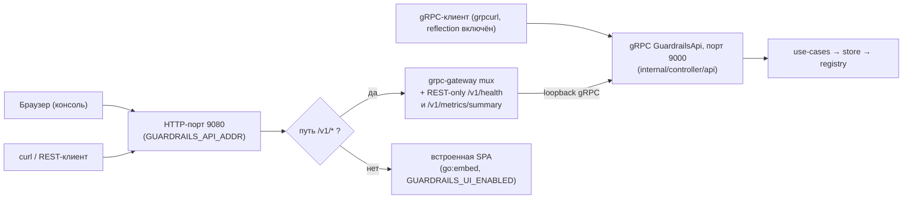
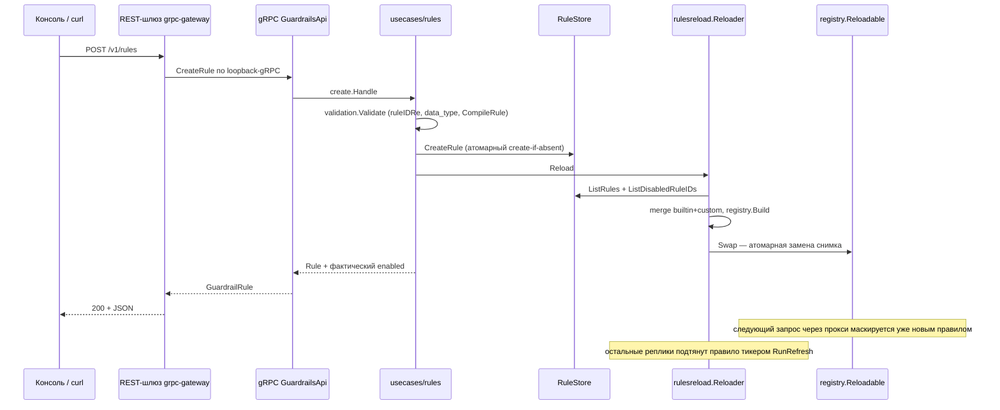

# Management API и веб-консоль

Контракт-первичный: management API определён proto-первично в
`api/proto/cloudru/guardrails/v1/**` (сервис `GuardrailsApi`) и генерируется через
`make gen-proto`. gRPC-сервер (реализация — `internal/controller/api`) слушает
`GUARDRAILS_GRPC_ADDR` (по умолчанию `:9000`); REST-фасад — grpc-gateway на
`GUARDRAILS_API_ADDR` (по умолчанию `:9080`, пусто отключает REST), собирается в
`internal/app/servers.go` и дозванивается до собственного gRPC-листенера по loopback.
Маршализатор grpc-gateway использует `UseProtoNames`+`UseEnumNumbers`+`EmitUnpopulated`,
поэтому REST-маршруты, snake_case-имена JSON-полей и числовые enum ниже соответствуют
контракту. Машиночитаемая спека: `service.swagger.json` в корне репозитория
(объединённый OpenAPI v2, генерируется — **не править руками; перегенерировать
`make gen-proto` после изменения `.proto`**).

На том же порту `:9080` рядом с `/v1/*` отдаётся встроенная **веб-консоль** (React-SPA,
вшита через `//go:embed`), гейтится `GUARDRAILS_UI_ENABLED` (по умолчанию включена; если
бинарь собран без консольного билда — no-op, сервится только API). Разводка по префиксу
исчерпывающая: всё управление живёт под `/v1/`, остальное уходит в SPA. Консоль делит
границу доверия API. Исходники и dev-инструкции — в каталоге `frontend/`.

Одна поверхность, три потребителя:



`/v1/health` и `/v1/metrics/summary` — REST-only маршруты консоли, зарегистрированные
прямо на gateway-mux; в proto-контракте и в gRPC их нет.

## Аутентификация

API **неаутентифицирован** — in-process-аутентификации нет ни на REST-порту, ни на
gRPC-порту (сервер логирует warning об этом при старте). На gRPC включён reflection;
`GUARDRAILS_GRPC_SECURE=true` вешает self-signed TLS на gRPC-листенер — это шифрование
транспорта, не аутентификация. Защищайте на сетевом уровне: держите оба порта только
внутри кластера и никогда не выставляйте через публичный ingress.

> **Административная плоскость, без объектной авторизации.** Это однотенантный admin API
> без аутентификации и без пообъектной проверки. Любой, кто до него дотянется, может
> читать и менять **любое** правило и читать **любую** аудит-запись
> (`GET /v1/audit/records`) — включая маскированные тексты запроса/ответа при
> соответствующих флагах. Относитесь как к control plane: держите вне недоверенных сетей
> и оставляйте флаги хранения текстов/оригиналов выключенными, если хранилище не под
> контролем доступа. См. [../operations/](../operations/).

## Эндпоинты

grpc-gateway не переопределяет success-коды: любой успешный вызов — **200** (в том числе
POST; DELETE отвечает `200` с телом `{}`). Ошибки — gRPC-статусы, спроецированные в HTTP:
InvalidArgument→400, FailedPrecondition→400, NotFound→404, AlreadyExists→409,
ResourceExhausted→429, Internal→500.

| Метод и путь | Поведение |
|---|---|
| `GET /v1/rules?source=all\|builtin\|custom` | список правил; неверный source → 400 |
| `POST /v1/rules` | создать кастомное правило → 200; валидация → 400; дубль id (custom **или builtin**) → 409; превышен лимит `GUARDRAILS_RULES_MAX_CUSTOM` (по умолчанию 500) → 429 |
| `GET /v1/rules/{rule_id}` | builtin или custom → 200; нет → 404 |
| `PUT /v1/rules/{rule_id}` | заменить кастомное правило → 200; `rule_id` берётся из пути и затирает значение в теле; builtin → 400; нет → 404 |
| `PATCH /v1/rules/{rule_id}` | включить/выключить правило (`{"enabled": false}`) — **единственная мутация, разрешённая над builtin** → 200 с правилом; `enabled` обязателен (protovalidate) / неизвестное поле → 400; нет правила → 404. Идемпотентно |
| `PATCH /v1/rules` | bulk-версия: `{"ids": [...], "enabled": false}` (1–1000 id, `enabled` обязателен); best-effort — каждый id независимо, ответ несёт per-item `status: ok\|error` → 200 |
| `DELETE /v1/rules/{rule_id}` | → 200 с `{}`; builtin → 400; нет → 404 (также снимает флаг disabled) |
| `GET /v1/settings` | текущие глобальные настройки (всегда с `mode`) |
| `PUT /v1/settings` | заменить настройки → 200; неизвестный тип данных или mode → 400. `mode` опционален: пропущен → `enforce` |
| `GET /v1/data-types` | группы из YAML-файлов (дедуп по числовому id) + синтетическая запись CUSTOM |
| `POST /v1/scan` | dry-run-маскирование сэмплов (`text`/`texts`, опционально `data_types` и несохранённое `candidate_rule`) продакшн-пайплайном; ничего не персистит, upstream не вызывает; пустой ввод или битое candidate-правило → 400 |
| `GET /v1/audit/records` | список аудит-записей маскирования (фильтры + курсорная пагинация); **только при `GUARDRAILS_AUDIT_ENABLED=true`**, иначе 400 (FailedPrecondition, «audit trail is disabled») |
| `GET /v1/audit/records/{request_id}` | аудит-запись одного запроса; нет/истёк → 404 |
| `GET /v1/version` | версия/коммит/дата сборки, `store_backend`, `topology` + живой `mode` |
| `GET /v1/health` | liveness + `mode`/`store_backend` (REST-only) |
| `GET /v1/metrics/summary` | JSON-агрегаты Prometheus-метрик для консоли: срабатывания по правилам/типам (top-20), passthrough, латентность p50/p95 (REST-only) |

Формат ошибки — стандартный для grpc-gateway: `{"code": <числовой gRPC-код>,
"message": "...", "details": [...]}`. Внутренние ошибки (500) не несут деталей
хранилища — текст заменяется generic-сообщением, подробности только в логах.

## Wire-типы (`internal/controller/api/converter.go`)

`GuardrailRule` повторяет `rule.Rule`, но это отдельный wire-тип — контракт не должен
дрейфовать с внутренностями движка. `source: builtin|custom` и `enabled` — только для
ответа (`enabled` отражает сохранённый disabled-набор; на входе принимаются, но
игнорируются). `protoToRule` ставит `DefaultOn: true` для правил из API.

Отключённые правила остаются в списке (с `enabled: false`), но исключаются из
скомпилированного снимка реестра; другие реплики сходятся через тикер
`GUARDRAILS_RULES_REFRESH_INTERVAL` (по умолчанию 30s).

Enum-поля (`data_type`, `data_types`) принимают на входе **числа или полные имена enum**
(`6` или `"DATA_TYPE_CUSTOM"` — так парсит protojson; короткие имена вроде `"custom"` не
принимаются) и всегда отдаются числами.

Неизвестные JSON-поля отклоняет protojson (→ 400); контрактные ограничения
(обязательный `enabled` в PATCH, 1–1000 id в bulk) проверяет protovalidate-интерцептор
на gRPC-сервере. Отдельного лимита размера тела на REST нет — действует дефолтный
gRPC-потолок входящего сообщения 4 MiB.

## Аудит-эндпоинты

- **Query-параметры списка**: `model`, `path` (точное совпадение), `rule_id`,
  `data_type` (вхождение в сработавшие в записи; `data_type` — число или имя
  `DATA_TYPE_*`), `since`/`until` (RFC3339; `since` включительно, `until`
  исключительно), `limit` (по умолчанию 50, максимум 500), `cursor`.
- **Пагинация**: keyset по `(timestamp desc, request_id desc)`; ответ несёт
  `next_cursor`, пока есть страницы. С redis-бэкендом сильно отфильтрованный запрос может
  вернуть короткую страницу **с** курсором — листайте, пока `next_cursor` не исчезнет.
- **Оригиналы**: `original` в `replacements` непуст только при включённом хранении
  оригиналов; зашифрованные значения расшифровываются на чтении, нерасшифровываемое
  (сменили ключ, выключили шифрование) молча опускается до placeholder-only — шифротекст
  наружу не уходит и чтение не падает. См. [../storage/](../storage/).
- **Ошибки**: битый курсор / битые параметры → 400, аудит выключен → 400, неизвестный
  request_id → 404, сбой хранилища → 500 (+ `audit_store_failures_total{op=get|list}`).

```sh
curl ':9080/v1/audit/records?data_type=5&limit=20'   # или data_type=DATA_TYPE_PERSONAL_DATA
curl ':9080/v1/audit/records/<x-request-id>'
```

## Поток мутации правила

Хендлеры делегируют per-scenario-хендлерам `internal/usecases/rules` (см.
[../rules-engine/custom-rules.md](../rules-engine/custom-rules.md)): валидация происходит
**до** записи (`ruleIDRe`, известный data_type, `CompileRule` — тот самый продакшн-путь
компиляции), затем запись в хранилище, затем `rulesreload.Reloader` пересобирает реестр
(builtin + custom минус disabled) и атомарно подменяет снимок. Правило, созданное через
API, активно на следующем запросе **без рестарта**; другие реплики подхватывают его в
пределах `GUARDRAILS_RULES_REFRESH_INTERVAL`.



Отказы: если правило записалось, а пересборка реестра упала, API вернёт 500, но правило
**уже в хранилище** — его подхватит следующая успешная пересборка (мутация или refresh).
Сбой самого refresh не рушит трафик: текущий снимок остаётся в силе (fail-open на
последнем известном наборе правил).

Маппинг ошибок use-case-слоя: `ValidationError` → 400, `ErrNotFound` → 404,
`ErrAlreadyExists` → 409, `ErrBuiltin` → 400 (FailedPrecondition),
`ErrTooManyRules` → 429, остальное → 500 без деталей.

## Пример сессии

```sh
# добавить правило (data_type 6 = CUSTOM)
curl -X POST :9080/v1/rules -d '{
  "rule_id":"acme_token","name":"ACME token","data_type":6,
  "regex":"\\bacme-[0-9a-f]{8}\\b","masking":{"placeholder":"ACME_TOKEN"}}'

# CUSTOM (6) должен быть во включённых типах данных, чтобы такие правила работали.
# PUT заменяет список целиком — не потеряйте 6 (дефолт 1–6 уже содержит его).
curl -X PUT :9080/v1/settings -d '{"enabled":true,"data_types":[1,2,3,4,5,6]}'
```

После этих двух вызовов следующий запрос маскирует `acme-deadbeef` в `<ACME_TOKEN_1>` на
upstream и демаскирует обратно в ответе клиенту.
