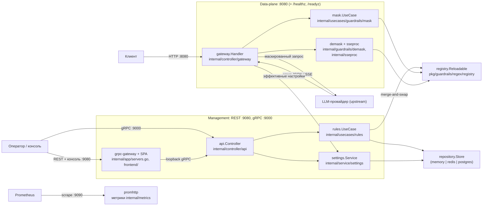
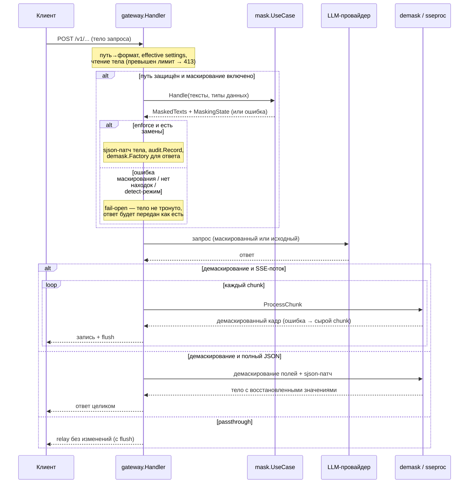
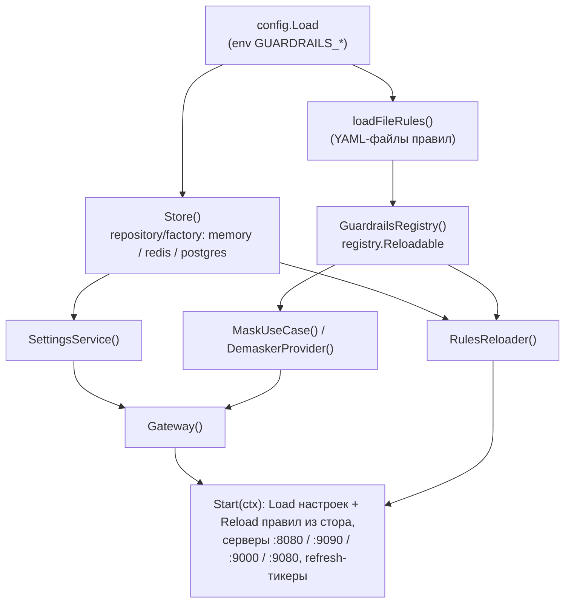

# Архитектура

Компоненты сервиса и их связи (каждый блок — реальный пакет, стрелки — вызовы в рантайме):

Клиенты обращаются к data-plane HTTP-серверу (`:8080`) вместо провайдера. Сервис сам
дозванивается до upstream (`GUARDRAILS_UPSTREAM_BASE_URL`), поэтому Envoy или прокси в
data-path нет. Management API определяется контрактом (proto → gRPC + grpc-gateway REST):
`:9000` — gRPC `GuardrailsApi`, `:9080` — REST-прокси grpc-gateway перед ним, на том же
порту отдаётся встроенная веб-консоль.

Подробности по разделам:
- [components.md](components.md) — карта пакетов и зон ответственности.
- [request-lifecycle.md](request-lifecycle.md) — жизненный цикл HTTP-запроса.

## Модуль

`github.com/cloud-ru-tech/guardrails-llm-filter`, Go 1.26. Приватных зависимостей нет;
заметные публичные: `tidwall/gjson+sjson` (извлечение/патч JSON), `redis/go-redis/v9`,
`jackc/pgx/v5`, `caarlos0/env/v11`, `goccy/go-yaml`, middleware и prometheus из
`grpc-ecosystem`, `anthropics/anthropic-sdk-go` (только типы ответов). Только для тестов:
`stretchr/testify`, `alicebob/miniredis/v2`, `testcontainers-go`, `go.uber.org/mock`.

## Data-path (горячий путь)

`internal/controller/gateway` — это `http.Handler`, смонтированный на
`POST /v1/chat/completions`, `/v1/messages`, `/v1/responses` (маппинг путь→формат берётся
из `config.DefaultGuardrailPaths` — та же карта, что использует валидация запроса).
Каждый запрос проходит один цикл mask→forward→demask, удерживая состояние на запрос
(метаданные, эффективные настройки, `MaskingState`). Поскольку запрос и его ответ
обрабатываются вместе, masking state живёт в процессе на время жизни запроса — внешнее
хранилище на data-path не требуется. Подробно — в [request-lifecycle.md](request-lifecycle.md).

Горячий путь по шагам; каждая ветка с ошибкой — passthrough
([инвариант 2, fail-open](#инварианты-нарушать-нельзя)):

## Сборка зависимостей (`internal/app/app.go`, `internal/app/servers.go`)

`internal/app/app.go` — DI-контейнер из ленивых мемоизированных геттеров (`Store()`,
`SettingsService()`, `RulesUseCase()`, `Gateway()`, `GrpcController()`, `GrpcServer()`,
…); геттеры **паникуют при некорректной конфигурации на старте** — это осознанно:
неправильная конфигурация должна убивать pod, а не деградировать молча.

Цепочка геттеров разворачивается в такой порядок сборки (каждый узел мемоизируется при
первом обращении):

Management-контроллер (`GrpcController()`) собирается поверх той же цепочки:
`RulesUseCase()` (за `RulesReloader()`), `SettingsService()` и scan use case поверх
`MaskUseCase()`.

`internal/app/servers.go` разводит серверы. `Start(ctx)` запускает:
- data-plane gateway-сервер (`GUARDRAILS_LISTEN_ADDR`, по умолчанию `:8080`) с
  `/healthz` и `/readyz`;
- сервер метрик Prometheus (`:9090`, namespace `extproc_guardrails`);
- management gRPC-сервер (`GUARDRAILS_GRPC_ADDR`, по умолчанию `:9000`) с перехватчиками
  recovery/logging(slog)/prometheus/protovalidate + reflection;
- management REST-сервер (grpc-gateway, `GUARDRAILS_API_ADDR`, `:9080`, пустой адрес
  отключает REST), проксирующий на локальный gRPC-порт.

Перед подъёмом серверов `Start` загружает настройки и custom-правила из стора
**fail-open** ([инвариант 2](#инварианты-нарушать-нельзя)): при ошибке сервис стартует на env-дефолтах и файловых
правилах, а фоновые refresh-тикеры (`SettingsService().RunRefresh`,
`RulesReloader().RunRefresh`) подтянут состояние, когда стор оживёт; те же тикеры сводят
реплики после изменений через API на общем сторе.

Data-plane gateway (`:8080`) и management API (gRPC `:9000` / REST `:9080`) — независимые
серверы. Остановка через экспортируемый `Stop()` (main использует `signal.NotifyContext`);
порядок: сначала data-plane (дренаж in-flight запросов, включая длинные SSE), затем REST,
gRPC и метрики, дренаж аудит-рекордера и `Close()` стора — всё в 10-секундном бюджете.
Логирование — stdlib `slog` за тонкими хелперами в `internal/logging`
(`logging.Error(ctx, msg, err, kv...)` — ошибка позиционна).

Встроенная **веб-консоль** (React-SPA в `frontend/`) вшита через `//go:embed all:dist`
(`frontend/embed.go`) и отдаётся на `/` на том же `:9080`. `servers.go` (`apiHandler`)
оборачивает mux grpc-gateway: `/v1/*` → API, всё остальное → SPA (с fallback на
`index.html` для клиентских маршрутов). Гейтится `GUARDRAILS_UI_ENABLED` (по умолчанию
true) **и** `frontend.Available()` (false, когда вшит только плейсхолдер `dist/.gitkeep`,
например при голом `go build`). Консоль делит неаутентифицированную границу доверия API —
держите порт внутри кластера.

## Инварианты (нарушать нельзя)

1. **Никогда не блокировать** — вердикт это маскировать/пропустить (enforce) или только
   просканировать и пропустить (detect-режим: метрики + аудит, тело не тронуто).
   Вердикта «заблокировать» в пайплайне не существует.
2. **Fail-open на data-path** — ошибки маскирования, хранилища, перезагрузки: лог +
   метрика + пропуск/удержание последнего валидного снимка. Любая ошибка на data-path
   пропускает трафик, а не ломает его.
3. **Никаких чувствительных значений в логах** — `MaskingState.Replacements` хранит
   оригиналы; их нельзя логировать.
4. **Только сужение через override** — заголовок запроса может лишь пересекаться с
   глобальными типами данных, но не расширять их; мусор на входе → заголовок полностью
   игнорируется (полная защита).
5. **Единственный путь валидации правил** — всё (загрузка файлов, create/update через
   API) компилируется через `registry.CompileRule`; второй реализации валидации быть не
   должно.
6. **Чтения снимка** — потребители data-path читают реестр через `Reloadable`;
   расхождение снимков внутри запроса допустимо (удалённое правило деградирует до «не
   применено»), рваный/частичный набор правил — нет.
