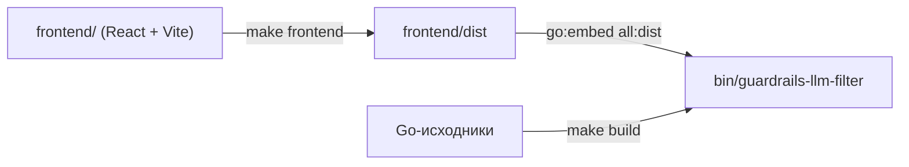
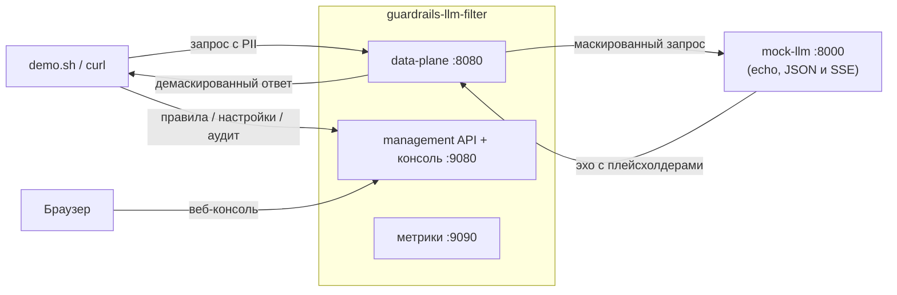

# Разработка

## Команды

```sh
make build            # ./bin/guardrails-llm-filter (вшивает frontend/dist)
make frontend         # собрать SPA-консоль в frontend/dist (вшивается в make build)
make run              # go run ./cmd/guardrails-llm-filter
make test             # go test -race ./...   (postgres-conformance нужен Docker, ~60s; без него авто-скип)
make test-short       # -short: пропускает тесты, зависящие от Docker
make lint             # golangci-lint run (конфиг: .golangci.yml)
make generate         # go generate ./... (go-enum должен быть в PATH для internal/models)
make rules-gen        # перегенерировать gitleaks-YAML правил из configs/gitleaks.toml
make gen-proto        # перегенерировать контракт management API (gRPC + grpc-gateway + OpenAPI) — нужны easyp + protoc-gen-*
make docker-build     # локальный образ (собирает и вшивает консоль)
make demo-up / demo-down   # quickstart-стек compose

go test ./internal/controller/gateway/   # тесты data-path
```

Бинарь с консолью — двухступенчатая сборка: SPA попадает в `frontend/dist`, откуда
её подхватывает `//go:embed all:dist` (`frontend/embed.go`); `make docker-build`
делает то же самое внутри стадии `node:22-alpine` Dockerfile.



CI: `.github/workflows/ci.yml` — build + `go test -race ./...`, golangci-lint, docker
build (без push), govulncheck, gitleaks-скан секретов.

## Стратегия тестирования (что есть, где)

| Область | Тесты |
|---|---|
| бэкенды хранилища | conformance-набор `internal/repository/repositorytest`; memory напрямую, redis через **miniredis** (TTL через `FastForward`), postgres через **testcontainers** (скип под `-short`) |
| настройки | табличные тесты для `Effective` (сужение, `none`, мусор→игнор, имена+числа) и `Service` (seed/предпочесть сохранённое/update/сходимость refresh) |
| сервис правил | матрица валидации, конфликты duplicate/builtin, shadow-skip при reload, конкурентный Create (-race) |
| реестр | ошибочные кейсы `Build`; замена `Reloadable` + race-тест конкурентных читателей/писателя |
| data-path | тесты `internal/controller/gateway` — маскирование запроса, форвард в upstream, демаскирование ответа (полное и SSE), fail-open, fallback хранилища |
| management API | `httptest`/gRPC против реальных сервисов + memory-store: CRUD, маппинг 400/404/409, настройки имена+числа |
| движок | юнит-тесты сканера/валидатора/загрузчика + data-driven корпус правил в `tests/rules` |
| SSE | тесты процессоров в `internal/sseproc/{chatcompletions,messages,responses}` |

Моки: `go.uber.org/mock`, паттерн `//go:generate mockgen -source=contract.go` в пакетах
mask/demask.

## Генерируемые файлы — не править руками

- `internal/models/data_type_enum.go` ← go-enum из ENUM-комментария в `data_type.go`
  (`cd internal/models && go generate ./...`).
- `configs/guardrails_regex_rules.gitleaks.generated.yaml` ← `make rules-gen`.
- `pkg/api/proto/**` и `service.swagger.json` ← `make gen-proto` (easyp) из `api/proto/**`.
  Правьте `.proto`-исходники, а не сгенерированные Go/JSON.

## Демо quickstart (`examples/quickstart`)

`make demo-up` (`docker compose up --build`): guardrails-llm-filter (собран из корня репо)
+ `mock-llm` (крошечный OpenAI-совместимый echo-сервер, который логирует то, что получил,
— т. е. маскированный текст — и отдаёт обратно, JSON или SSE). Топология:



`bash demo.sh` прогоняет сценарий: mask/demask без стриминга, SSE (`/v1/chat/completions`
и `/v1/responses`), добавление кастомного правила через API и его срабатывание, выборка
аудит-записей. Это самый быстрый сквозной способ проверить изменение data-path
(подробно о пути запроса — [architecture/request-lifecycle.md](../architecture/request-lifecycle.md)):
лог mock должен показывать плейсхолдеры, ответ клиенту — оригиналы,
`x-guardrails-data-types-triggered` должен присутствовать. Веб-консоль —
`http://localhost:9080`; аудит в демо включён, причём
`GUARDRAILS_AUDIT_STORE_ORIGINAL_TEXTS=plain` хранит оригиналы значений за
плейсхолдерами — только для демо, в проде `off` или `encrypted`.

## Dev-цикл консоли (frontend)

Два процесса: Go-сервис отдаёт management API на `:9080`, Vite dev-сервер
(`npm run dev`, `:5173`, hot reload) проксирует `/v1` в него —
`frontend/vite.config.ts`, target из `GUARDRAILS_API_URL` (по умолчанию
`http://localhost:9080`). Та же same-origin-модель, что и в проде; пересобирать
Go-бинарь при правках UI не нужно.

```sh
GUARDRAILS_AUDIT_ENABLED=true ./bin/guardrails-llm-filter   # 1) API на :9080
cd frontend && npm run dev                                   # 2) консоль на :5173
```

Типы API генерируются из `frontend/spec/openapi.yaml` (`npm run gen`, запускается и в
`npm run build`) — при изменении management API обновите спеку. Подробности —
[frontend/README.md](../../frontend/README.md).

## Подводные камни

- Префикс `env.ParseWithOptions`: добавление поля конфига означает имя env `GUARDRAILS_` +
  под-префикс + тег. Следите за случайным удвоением `GUARDRAILS_GUARDRAILS_*`.
- Паники в геттерах `internal/app` на старте намеренны (fail-fast на misconfig);
  рантайм-пути должны оставаться fail-open.
- Плейсхолдеры (`<EMAIL_1>`) должны переживать сериализацию байт-в-байт — маршалинг ответа
  идёт без HTML-экранирования.
- Веб-консоль вшивается через `//go:embed all:dist`; при голом `go build` без
  `make frontend` вшит только `dist/.gitkeep`, и сервис отдаёт лишь API.
