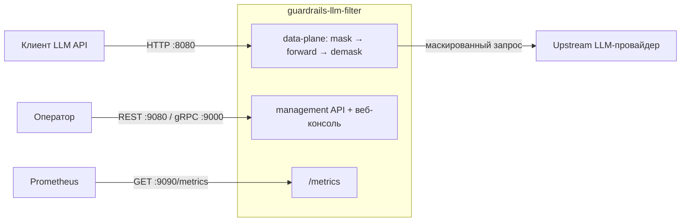
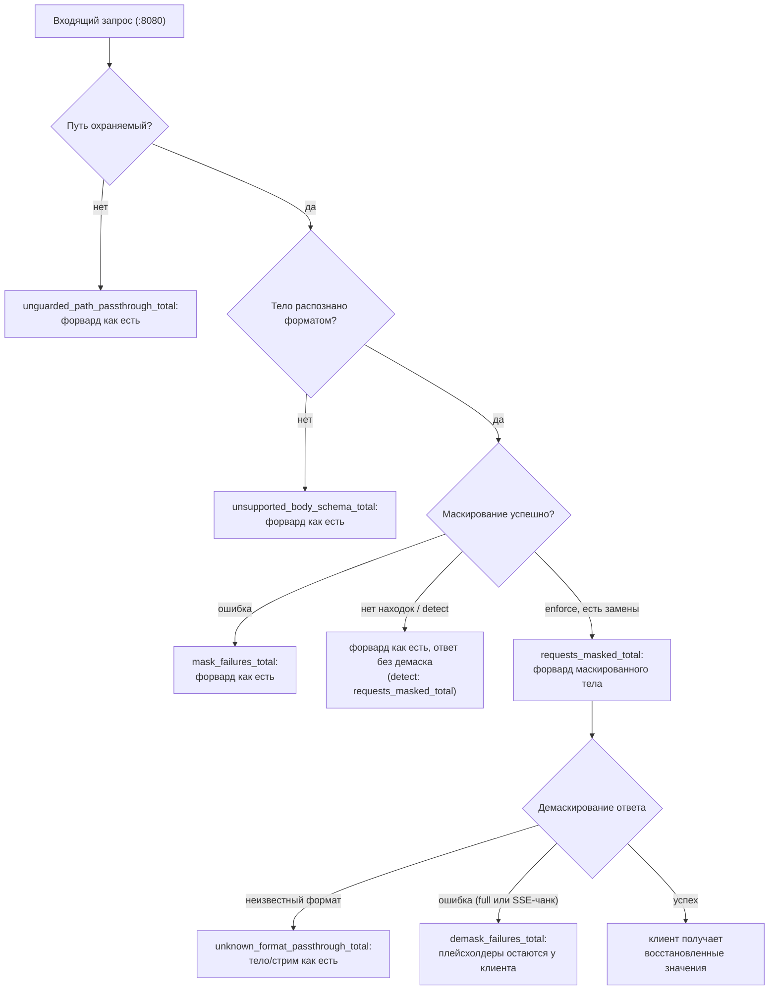

# Эксплуатация

## Порты

| Порт | Протокол | Назначение |
|---|---|---|
| 8080 | HTTP | data-plane (сюда обращаются клиенты); `GET /healthz` (liveness) и `GET /readyz` (readiness), `GUARDRAILS_LISTEN_ADDR` |
| 9000 | gRPC | management API (`GuardrailsApi`), `GUARDRAILS_GRPC_ADDR` |
| 9080 | HTTP | management API (REST-прокси grpc-gateway) + встроенная веб-консоль, `GUARDRAILS_API_ADDR` (пусто отключает) |
| 9090 | HTTP | Prometheus `/metrics`, `GUARDRAILS_METRICS_PORT` |

Кто куда ходит:

## Метрики (namespace `extproc_guardrails_`)

| Метрика | Тип / метки | Смысл |
|---|---|---|
| `pipeline_duration_seconds` | histogram | суммарное время mask+demask на запрос |
| `mask_duration_seconds` | histogram | маскирование запроса + мутация тела |
| `mask_scan_duration_seconds` / `scan_duration_seconds` | histogram | regex-скан, все тексты / на текст |
| `mask_texts_count`, `mask_scan_text_bytes`, `mask_scan_total_bytes` | histogram | объём скана |
| `demask_duration_seconds` | histogram | демаскирование полного (non-SSE) ответа |
| `sse_chunk_demask_duration_seconds` | histogram | на SSE-кусок |
| `triggered_rules_count` | histogram | различных правил на запрос |
| `rule_triggers_total` | counter `{rule_id}` | срабатывания правил на уровне запроса |
| `data_type_triggers_total` | counter `{data_type}` | срабатывания типов данных на уровне запроса |
| `requests_masked_total` | counter `{mode=enforce\|detect}` | запросы, где хотя бы одно значение было замаскировано (enforce) или было бы (detect); чистый сигнал на запрос для алертинга. Вид shadow-раскатки: `sum by (mode) (rate(...[5m]))` |
| `mask_failures_total` | counter | ошибки сценария маскирования (fail-open пропуск) |
| `demask_failures_total` | counter `{mode=full\|sse}` | сбои/откаты демаскирования |
| `masking_state_store_failures_total` | counter `{op=put\|get\|delete\|decrypt}` | fail-open ошибки хранилища masking state; `decrypt` = недешифруемая запись. В standalone-шлюзе data-path к стору не обращается, так что серия в норме отсутствует |
| `audit_store_failures_total` | counter `{op=put\|get\|list}` | ошибки хранилища аудита |
| `audit_records_dropped_total` | counter | аудит-записи, отброшенные при переполнении очереди async-записи |
| `unknown_format_passthrough_total` | counter | тела/SSE-стримы ответа, пропущенные без демаскирования из-за неизвестного формата API в masking state (fail-open) |
| `unsupported_body_schema_total` | counter | тела запроса, пропущенные без маскирования из-за нераспознанной схемы (fail-open); ненулевой темп обычно значит, что путь в `GUARDRAILS_PATHS` привязан к неверному формату |
| `unguarded_path_passthrough_total` | counter | запросы, проксированные на upstream без маскирования, потому что путь не совпал ни с одним охраняемым путём LLM |

Плюс стандартные серверные gRPC-метрики из `go-grpc-prometheus` (management API :9000).
Пошаговое подключение Prometheus/Alertmanager/Grafana — в
[../monitoring/README.md](../monitoring/README.md).

## Алертинг

Алертинг pull-based: Prometheus вычисляет правила по метрикам выше, Alertmanager
маршрутизирует уведомления. Поставляемые артефакты:

- `deploy/prometheus/guardrails-llm-filter-alerts.yml` — обычная группа правил Prometheus
  (добавьте в `rule_files`). Валидация после правок:
  `promtool check rules deploy/prometheus/guardrails-llm-filter-alerts.yml`.
- `deploy/kubernetes/components/monitoring/` — opt-in kustomize-компонент для
  prometheus-operator: `ServiceMonitor` (скрейпит порт `metrics` каждые 30s) +
  `PrometheusRule` с **той же группой — держите два файла синхронными**.

Поставляемые алерты (подстройте пороги и матчер `job` под своё окружение):

| Алерт | Severity | Смысл |
|---|---|---|
| `GuardrailsMaskingFailures` | critical | ошибки маскирования → запросы ушли на upstream **немаскированными** (fail-open) |
| `GuardrailsDemaskFailures` | warning | клиенты могут видеть сырые плейсхолдеры |
| `GuardrailsStateStoreFailures` | warning | межрепличное демаскирование под угрозой |
| `GuardrailsAuditWriteFailures` / `GuardrailsAuditRecordsDropped` | warning | пробелы в аудит-трейле |
| `GuardrailsMaskedTrafficSpike` | warning | темп маскированных запросов 3× к тому же окну вчера — возможная утечка PII в промптах |
| `GuardrailsPipelineSlow` | warning | p99 mask+demask > 1s в течение 10m |
| `GuardrailsScrapeDown` | critical | нет метрик — сервис не скрейпится или недоступен |

### Дашборд Grafana

`deploy/grafana/dashboard.json` — импорт через *Dashboards → Import* (или provisioning);
при импорте спрашивает datasource Prometheus. Ряды: трафик и детекции (темп маскированных
запросов по `mode`, топ сработавших правил, разбивка по типам данных), латентность
(pipeline p50/p90/p99, перцентили mask/scan/demask, объём скана), fail-open-ошибки
(mask/demask/store/audit) и здоровье сервиса. Дашборд **не несёт алертов Grafana** — две
копии правил Prometheus остаются единым источником истины для алертинга.

## Аудит-трейл

`GUARDRAILS_AUDIT_ENABLED=true` пишет пофазовые метаданные маскирования (правила, типы
данных, плейсхолдеры) в хранилище и открывает `GET /v1/audit/records[?filters]` /
`GET /v1/audit/records/{id}` на config API. Retention `GUARDRAILS_AUDIT_RETENTION` (по
умолчанию 24h); записи асинхронны и fail-open. Флаги `STORE_MASKED_TEXTS`,
`STORE_MASKED_RESPONSE_TEXTS`, `STORE_ORIGINAL_TEXTS` включают хранение дополнительного
чувствительного контента — см. чеклист ниже.

## Заголовки ответа

- `x-guardrails-data-types-triggered: 5,2` — когда маскирование сработало.
- `x-guardrails-triggered-rules: pii.email,...` — только с
  `GUARDRAILS_HEADERS_EXPOSE_TRIGGERED_RULES=true`.

## Деплой

- **Docker**: корневой `Dockerfile` — multi-stage. Стадия `node:24-alpine` собирает
  веб-консоль (`frontend/dist`), которая вшивается в Go-бинарь; runtime — distroless,
  non-root. `make docker-build` собирает всё из корня репо.
- **Kubernetes**: kustomize-база `deploy/kubernetes/` — deployment (HTTP-пробы `/healthz`
  и `/readyz` на 8080, envFrom configmap + secret), service, configmap (`GUARDRAILS_*`),
  secret (креды хранилища). В configmap задайте `GUARDRAILS_UPSTREAM_BASE_URL`. Клиенты
  обращаются к сервису напрямую — edge-прокси в data-path не нужен.
- **Много реплик**: используйте хранилище `redis`/`postgres`, чтобы кастомные
  правила/настройки были общими; тикеры обновления (30s по умолчанию) сходят изменения
  политики. Masking state живёт in-process: один `ServeHTTP` выполняет
  mask→forward→demask на одной реплике, межрепличный round-trip состояния не нужен.

## Чеклист безопасности для операторов

1. Data-plane порт (`:8080`) публично-обращён — держите на нём разумный
   `GUARDRAILS_MAX_REQUEST_BYTES` и, при необходимости, фронтящий шлюз, который вырезает
   override-заголовок (`x-guardrails-data-types`) из недоверенного клиентского трафика:
   подделанный `x-guardrails-data-types: none` иначе отключит маскирование для этого
   запроса.
2. Если используете общее хранилище (`redis`/`postgres`) с несколькими репликами,
   `x-request-id` должен задаваться доверенной стороной, а не приниматься от
   неаутентифицированного клиента (ключ masking state; см.
   [../configuration/settings.md](../configuration/settings.md)).
3. Config API (REST :9080 и gRPC :9000) и веб-консоль, **включая `/v1/audit`, —
   административная плоскость** без аутентификации и без пообъектной авторизации.
   Защищайте на сетевом уровне: держите порты только внутри кластера, недоступными
   недоверенным сетям, и никогда не выставляйте через публичный ingress.
4. С хранилищем redis/postgres: ограничьте доступ — masking state держит исходные
   чувствительные значения (TTL'ятся). Включённый `STORE_ORIGINAL_TEXTS` также сохраняет
   оригиналы за плейсхолдерами (используйте `encrypted` и ограничьте доступ).
5. Помните, что сервис внутренне **fail-open**: сбой маскирования пропускает трафик на
   upstream немаскированным. Мониторьте `GuardrailsMaskingFailures`.
6. Не гоняйте уровень лога `debug` в проде (на debug логируются заголовки запросов).
7. `GUARDRAILS_UPSTREAM_INSECURE_SKIP_VERIFY` только для локального тестирования: ответ,
   который сервис читает обратно, демаскируется до оригинальных секретов, поэтому MITM на
   непроверенном TLS-канале их увидит.

## Режимы отказа

Каждое fail-open-решение data-path наблюдаемо своим счётчиком
(`internal/controller/gateway`, `internal/sseproc`):

| Отказ | Поведение |
|---|---|
| хранилище недоступно на старте | pod не стартует (Ping фабрики) — намеренно |
| хранилище недоступно в рантайме | data-path не затронут (in-process-состояние), мутации правил через API падают, reload держит последний снимок, счётчики тикают |
| файл правил невалиден на старте | паника — намеренно |
| невалидное кастомное правило в хранилище | пропускается, только если перекрывает builtin; иначе `Build` падает и продолжает работать предыдущий снимок |
| ошибка masker/demasker | пропуск маскированного/исходного контента, метрика + лог |
| upstream недоступен | ошибка форварда возвращается клиенту (сервис — прозрачный прокси в data-path) |
