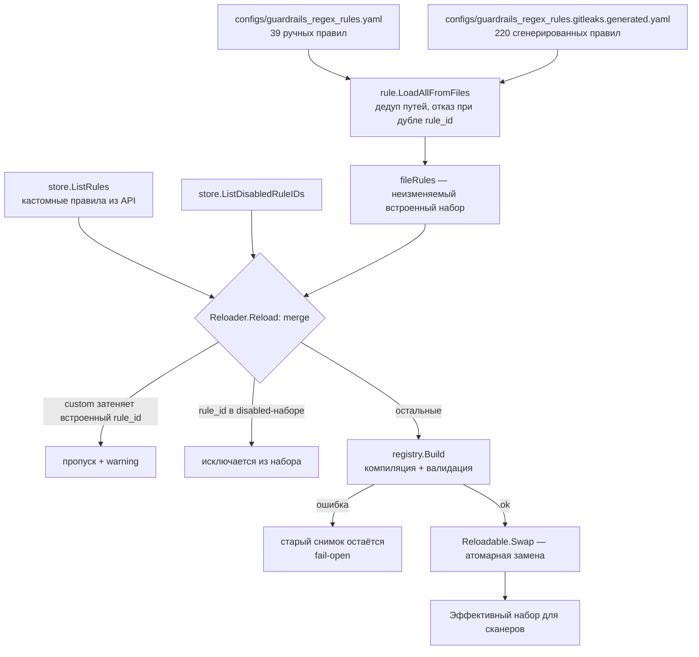
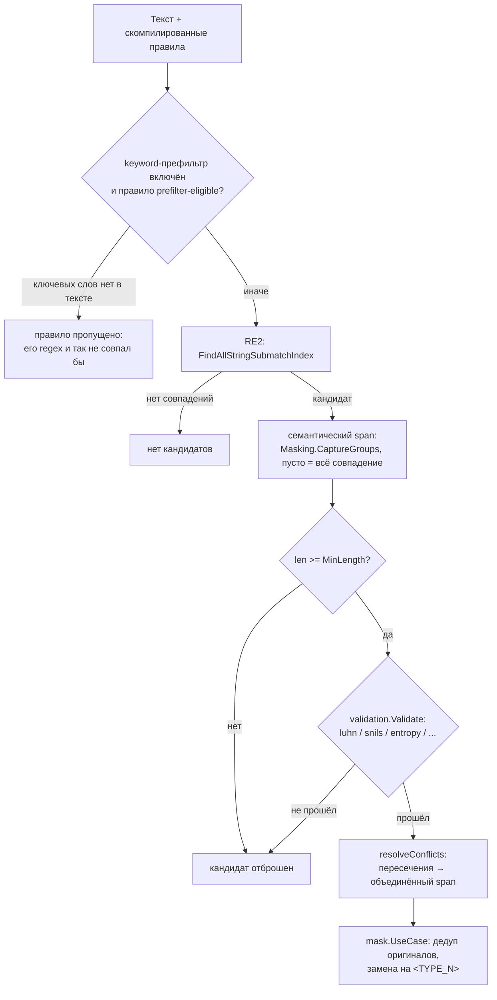
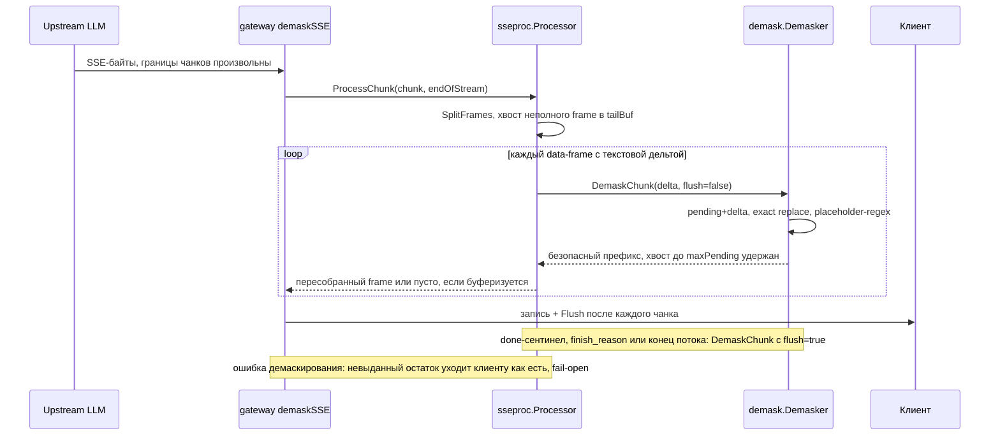

# Движок правил

Вся детекция построена на regex (RE2) с опциональными пост-валидаторами. ML/LLM-проверок
в сервисе нет.

Про создание правил через API и добавление встроенных правил см.
[custom-rules.md](custom-rules.md). Где скан/маскирование/демаскирование стоят в пути
запроса — [architecture/request-lifecycle.md](../architecture/request-lifecycle.md).

## Схема правила (`pkg/guardrails/regex/rule/rule.go`)

```go
type Rule struct {
    ID         string          // yaml: rule_id, json: rule_id; уникален среди ВСЕХ правил
    Name       string
    Group      string          // yaml: из родительской группы; json: сериализуется (обязан round-trip'ить отдельно)
    DataType   int             // yaml: из родительской группы; json: сериализуется
    Regex      string          // RE2, компилируется с префиксом (?m)
    Keywords   []string         // опциональный сохраняющий полноту пре-фильтр (под GUARDRAILS_KEYWORD_PREFILTER_ENABLED); только для правил, чей regex гарантирует ключевое слово в каждом совпадении, регистронезависимо
    Validators []ValidatorType
    MinLength  int
    Entropy    float64         // порог для валидатора энтропии
    Banlist    []string        // приводится к нижнему регистру при загрузке; для валидатора banlist
    DefaultOn  bool
    Masking    MaskingConfig   // CaptureGroups []int (с 1; пусто = всё совпадение), Placeholder string
}
```

Группы `DataType` (числовые ID — сквозной контракт между go-enum в
`internal/models/data_type.go`, YAML-файлами, override-заголовком и API): `0 UNSPECIFIED`
(правил не несёт), `1 CREDENTIALS`, `2 API_KEYS`, `3 ACCESS_TOKENS`, `4 IP_ADDRESSES`,
`5 PERSONAL_DATA`, `6 CUSTOM` (зарезервирован под правила из API; файловых правил не имеет).

## Источники правил

1. `configs/guardrails_regex_rules.yaml` — ручные (~39 правил: ФИО и российские PII с
   контрольными суммами — СНИЛС, ИНН физлица/юрлица, ОГРН/ОГРНИП, паспорт; платёжные
   карты с Luhn; IBAN mod-97; email'ы; телефоны РФ; IP).
2. `configs/guardrails_regex_rules.gitleaks.generated.yaml` — ~220 правил,
   сгенерированных из `configs/gitleaks.toml` через `cmd/rulesgen import-gitleaks`
   (`make rules-gen`). **Генерируется — не править руками.**
3. Кастомные правила из хранилища (созданы через API), подмешиваются в рантайме
   reloader'ом (`internal/service/rulesreload`), который триггерят сценарии
   `internal/usecases/rules`.

Загрузчик (`rule/loader.go`): верхнеуровневый YAML-ключ `guardrails_regex_rules`,
группы несут `data_type/name/display_name/...`, правила наследуют `Group`/`DataType` от
родителя. `LoadAllFromFiles` дедуплицирует пути файлов и отклоняет дублирующиеся
`rule_id` между файлами.

Слияние источников в эффективный набор (детали merge — в разделе про reloader ниже):



## Реестр (`pkg/guardrails/regex/registry`)

`Registry` — неизменяемый скомпилированный снимок: `rules []CompiledRule` + индексы
`byDataType`, `byID`. `CompiledRule` добавляет `Re` (скомпилированный regex),
`PlaceholderRe` и `PlaceholderLen` (см. демаскирование ниже).

Пути конструирования — **одна реализация валидации**:

- `Register(rules...)` — паникующий; только путь загрузки файлов на старте.
- `Build(rules...) (*Registry, error)` / `Add(rule) error` /
  `CompileRule(reg, rule) (CompiledRule, error)` — с возвратом ошибки; используются
  сервисом правил и (косвенно) API. Проверки: непустой ID, отсутствие дубля ID,
  известные валидаторы (`validation.IsKnown`), компиляция regex, группы захвата в
  границах, ограниченность placeholder-regex.

`Reloadable` (`reloadable.go`) оборачивает снимок в `atomic.Pointer` с делегирующими
методами чтения, поэтому `sensitive.Scanner`, `placeholder.Scanner`, `mask.UseCase` и
`demask.Provider` берут его без изменений кода. Контракт согласованности: запрос может
резолвить ID правил на снимке N и брать скомпилированные правила из N+1; неизвестные ID
молча пропускаются, поэтому худший случай замены посреди запроса — «правило не
применено», а не паника.

## Reloader реестра (`internal/service/rulesreload`)

- `Reload`: store.ListRules + store.ListDisabledRuleIDs → merge с файловыми правилами
  (**кастомные правила не могут перекрывать встроенный rule_id** — перекрывающие записи
  пропускаются с предупреждением, так что одна плохая строка хранилища не уронит набор
  правил; правила из disabled-набора — builtin или custom — исключаются, поэтому сканер
  их не видит) → `registry.Build` → `Reloadable.Swap` (под мьютексом, так что замены
  никогда не рваные). Ошибки хранилища удерживают текущий снимок (fail-open).
- Тикер `RunRefresh` пере-`Reload`'ит для сходимости реплик (покрывает и кастомные
  правила, и изменения disabled-набора, сделанные на других репликах).

## Скан и маскирование

`scanners/sensitive.Scanner.Scan(text, ruleIDs)`:
- опциональный keyword-пре-фильтр (дешёвый `strings.Contains` по тексту в нижнем
  регистре) перед запуском regex — **выключен по умолчанию**, включается
  `GUARDRAILS_KEYWORD_PREFILTER_ENABLED=true`. Он **сохраняет полноту**: правило
  участвует, только если его regex *гарантирует*, что ключевое слово есть в каждом
  возможном совпадении (доказано на этапе компиляции обходом дерева `regexp/syntax`;
  выставлено как `CompiledRule.PrefilterKeywords`). Такое правило пропускается, когда ни
  одного из его ключевых слов нет в тексте — а для таких правил это значит, что regex и
  так не мог совпасть, поэтому результат идентичен запуску. Любое другое правило (без
  keywords, или с ключевым словом, которого regex не требует) сканируется всегда.
  Пропущенные так правила логируются на старте. Чистая оптимизация скорости, никогда не
  компромисс детекции;
- правила раскладываются по CPU и сканируются параллельно, но только когда есть что
  делить: текст ≥ 4 КиБ и правил > 4, иначе последовательный путь (для мелких полей
  горутины дороже самих regex'ов). Паника воркера перехватывается и превращается в
  ошибку — деградация fail-open вместо падения процесса;
- `FindAllStringSubmatchIndex` → кандидат; из совпадения выбирается семантический span
  по `Masking.CaptureGroups` (побеждает первая совпавшая группа; пусто = всё
  совпадение), затем применяются `MinLength` и `validation.Validate` (контрольные
  суммы/энтропия/banlist/формат);
- `resolveConflicts`: пересекающиеся совпадения сливаются в один объединённый span
  `[minStart, maxEnd)`, атрибутируемый самому длинному составляющему (его тип
  плейсхолдера помечает значение). Маскируется объединение, а не «победитель»:
  отбрасывание более короткого совпадения выпустило бы его непересекающиеся байты
  открытым текстом. Результат отсортирован по `Start` и непересекающийся.

Путь одного текста через сканер:



`mask.UseCase` дедуплицирует одинаковые оригиналы (одно значение → один плейсхолдер
внутри запроса), назначает инкрементные индексы на тип плейсхолдера (`<EMAIL_1>`,
`<EMAIL_2>`, `<NAME_1>`) через `placeholderfmt.Format` и возвращает
`MaskingState.Replacements` (ID правила + оригинал + плейсхолдер).

### Валидаторы (`pkg/guardrails/regex/validation`)

`luhn, snils, inn_person, inn_org, ogrn, ogrnip, iban_mod97, email_ascii, payment_card,
entropy, banlist, ip_v4, ip_v6, ip_public, ip_private`.

## Демаскирование

- Каждое правило с плейсхолдером получает **regex распознавания плейсхолдера**,
  построенный при компиляции (`buildDefaultPlaceholderRegexp`): терпит до 3 символов
  дрейфа/пробелов/подчёркиваний, которые может внести LLM (`< EMAIL_1 >`, `<EMAIL-1>`),
  регистронезависим, с группой захвата индекса. `PlaceholderLen` — статическая верхняя
  граница длины совпадения (`regexpMaxLen` обходит дерево синтаксиса regex;
  неограниченные паттерны отклоняются).
- `scanners/placeholder.Scanner` находит вхождения плейсхолдеров;
  `internal/guardrails/demask` сопоставляет их обратно через `Replacements` запроса.
  Сначала дешёвый точный `strings.Replacer` по всем плейсхолдерам запроса, затем
  placeholder-regex — для форм с дрейфом.
- Область видимости: `Provider` (синглтон приложения, держит реестр+сканер) →
  `NewFactory(MaskingState)` (на запрос) → `Demasker()` (на поток/поле;
  `DemaskChunk(ctx, chunk, flush)` держит хвостовой буфер `pending` до длины
  максимального плейсхолдера, чтобы разбитые плейсхолдеры пересобирались; UTF-8-безопасно).
  `JSONDemasker()` — вариант для JSON-фрагментов (tool-аргументы): восстановленные
  оригиналы JSON-экранируются, иначе кавычка/бэкслеш в оригинале ломали бы JSON,
  который аккумулирует клиент.
- Контракт ошибок: при сбое `DemaskChunk` возвращает вместе с ошибкой весь невыданный
  остаток (нерешённые плейсхолдеры остаются как есть) — вызывающий обязан отдать его
  клиенту (fail-open, хвост потока не теряется), после чего демаскирование этого
  поля прекращается.

### SSE-поток (`internal/sseproc`)

Non-SSE ответ демаскируется целиком: gateway (`internal/controller/gateway/response.go`)
извлекает текстовые поля, демаскирует каждое одним вызовом `DemaskChunk(..., flush=true)`
и патчит обратно через sjson (fail-open на поле). Для SSE фасад `sseproc.NewForFormat`
выбирает форматный процессор — `chatcompletions` (OpenAI `/v1/chat/completions`),
`messages` (Anthropic `/v1/messages`), `responses` (OpenAI `/v1/responses`); неизвестный
формат → passthrough без изменений (fail-open). Процессор режет байтовый поток на
SSE-frame'ы (неполный frame переносится между чанками), ведёт по отдельному демаскеру
на каждую тройку (choice, tool_call, поле) — tool-аргументы получают `JSONDemasker` —
и пересобирает frame'ы из демаскированных дельт.

Токен-за-токеном:


