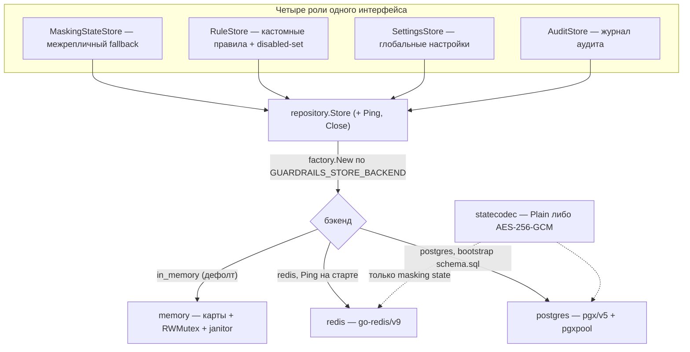
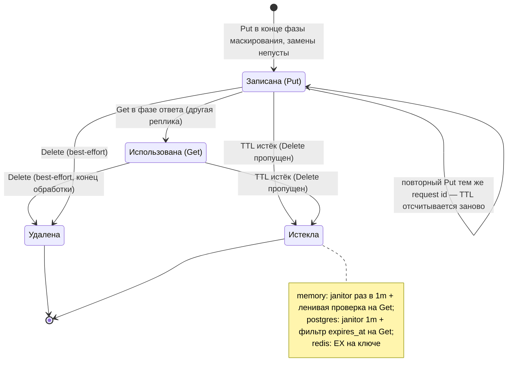

# Хранилище

Один выбираемый через env бэкенд (`GUARDRAILS_STORE_BACKEND`) обслуживает **четыре
роли** за `internal/repository.Store`:

```go
MaskingStateStore  // Put/Get/DeleteMaskingState(ctx, requestID, state)
RuleStore          // ListRules / GetRule / CreateRule / SaveRule (upsert) / DeleteRule
                   //   + ListDisabledRuleIDs / SetRuleDisabled — набор ID, отключённых через API
SettingsStore      // GetSettings (nil,nil = никогда не задавали) / SaveSettings
                   //   + SaveSettingsIfAbsent — атомарный seed-once env-дефолтов при старте
AuditStore         // Put/GetAuditRecord (upsert) / ListAuditRecords (фильтр + курсор)
                   //   + SetAuditResponseTexts — обогащение записи фазой ответа
Store              // все четыре + Ping + Close
```

`repository.ErrNotFound` — общий sentinel «не найдено»; `ErrAlreadyExists` — ответ
`CreateRule` на занятый ID (атомарно в каждом бэкенде: проверка под mutex / `HSETNX` /
`ON CONFLICT DO NOTHING`). Подпакет `factory`
(`internal/repository/factory`) строит бэкенд — он в подпакете, потому что пакет
интерфейсов должен оставаться импортируемым реализациями (иначе цикл импортов). Внешние
бэкенды `Ping`'уются на старте, чтобы неправильная конфигурация ломала старт pod'а, а не
data-path.

Роли, интерфейс и сборка бэкенда:



На data-path masking state обычно живёт **в процессе**: запрос и его ответ
обрабатываются одним обработчиком, поэтому одиночной реплике внешнее хранилище для
маскирования не нужно. Хранилище нужно для durable кастомных правил/настроек/аудита и как
межрепличный fallback для masking state.

## Контракт жизненного цикла masking state

- **Ключ**: значение `x-request-id` запроса; fallback `uuid.NewString()` при отсутствии.
  - **ИНВАРИАНТ БЕЗОПАСНОСТИ**: при общем внешнем хранилище и нескольких репликах фаза
    ответа может откатиться к `GetMaskingState(x-request-id)`, если запрос обработала
    другая реплика; тогда `x-request-id` должен задаваться доверенной стороной (сервисом
    или фронтящим шлюзом), а не приниматься от неаутентифицированного клиента — иначе
    клиент, подделавший живой request id жертвы, мог бы демаскировать её оригиналы в свой
    ответ.
- **Put**: конец фазы маскирования запроса, только если замены непусты (best-effort, для
  межрепличного случая).
- **Get**: фаза ответа, только если in-process-состояние пусто (запрос обработала другая
  реплика).
- **Delete**: best-effort в конце обработки запроса.
- **TTL** (`GUARDRAILS_STORE_MASKING_TTL`, по умолчанию 15m) — страховка от пропущенных
  удалений; должен превышать самый длинный ожидаемый стриминговый ответ.
- **Все ошибки data-path только логируются + метрика
  (`masking_state_store_failures_total{op}`)** — сбой хранилища не должен блокировать
  трафик. Худший случай: плейсхолдеры остаются недемаскированными, когда состояние
  записала другая реплика.

Жизненный цикл одной записи (ключ — request id):



Истёкшая, но ещё не вычищенная запись неотличима от отсутствующей: Get везде возвращает
`ErrNotFound`, как только TTL прошёл, независимо от того, добрался ли уже janitor.

### Безопасность

`MaskingState.Replacements` содержит **исходные чувствительные значения**. С
`redis`/`postgres` они покидают память процесса. Меры: короткий TTL, хранилище с
ограниченным доступом, отсутствие логирования и **опциональное шифрование на месте**.

#### Шифрование на месте (`GUARDRAILS_STORE_ENCRYPTION_*`)

`GUARDRAILS_STORE_ENCRYPTION_ENABLED=true` + `GUARDRAILS_STORE_ENCRYPTION_KEY=<base64
32-байтный ключ>` (сгенерируйте `openssl rand -base64 32`) шифруют сериализованный
masking state алгоритмом **AES-256-GCM** перед отправкой во внешний бэкенд
(`internal/repository/statecodec`, подключается фабрикой к `redis` и `postgres`; no-op
для `in_memory`). Отсутствующий или битый ключ ломает старт; ключ не логируется. Обе
env-переменные — в справочнике [../configuration/](../configuration/).

Сохранённое значение становится JSON-конвертом — всё ещё валидный JSONB, поэтому схема
postgres не меняется:

```json
{"_enc":"aes256gcm","v":1,"data":"<base64(nonce||ciphertext)>"}
```

Семантика:

- **Постепенное включение**: с включённым шифрованием старые plaintext-записи всё ещё
  читаемы (конверт распознаётся по ключу `_enc`); все записи шифруются в пределах одного
  masking-TTL (≤15m по умолчанию).
- **Выключение при наличии зашифрованных записей**: чтения падают с
  `repository.ErrUndecryptable` — всплывает как `op="decrypt"` в
  `masking_state_store_failures_total` и warning-лог, трафик остаётся fail-open.
- **Ротация ключа** — это рестарт с новым ключом: старые записи становятся недешифруемыми
  и истекают в пределах masking-TTL. Мультиключевой поддержки нет.

## Контракт аудит-записи (`AuditStore`)

Пишется `internal/service/audit.Recorder` (асинхронно, с ограничением одновременных
записей, fail-open) при `GUARDRAILS_AUDIT_ENABLED=true` и наличии замен в запросе;
читается эндпоинтами `/v1/audit`.

- **Upsert по request_id** — повторный запрос с тем же request_id перезаписывает запись
  (последняя запись побеждает).
- **Порядок**: `(Timestamp desc, RequestID desc)`; **курсор** =
  `base64url("<unixNano>:<requestID>")` (`internal/repository/cursor.go`, `ErrBadCursor`
  на мусоре). Размер страницы по умолчанию 50, максимум 500 (`AuditQuery.ClampAuditLimit`).
- **Таймстемпы усечены до микросекунд каждым бэкендом** — postgres TIMESTAMPTZ и score
  ZSET в redis не держат наносекунды, а математике курсора нужно, чтобы JSON-документ и
  индекс совпадали.
- **Retention**: `GUARDRAILS_AUDIT_RETENTION` (по умолчанию 24h). Единственная чистка это
  истечение.
- Записи несут ID правил, типы данных и плейсхолдеры. Оригиналы за плейсхолдерами
  хранятся только при `GUARDRAILS_AUDIT_STORE_ORIGINAL_TEXTS` ≠ `off` (по умолчанию off);
  `masked_texts`/`masked_response_texts` (opt-in) — пользовательский контент, усекаемый
  рекордером до 64 KiB на текст. Подробнее — в [../configuration/](../configuration/) и
  [../../SECURITY.md](../../SECURITY.md).

Раскладка по бэкендам:

- **memory**: `map[string]auditEntry` под общим RWMutex; janitor вытесняет истёкшие
  аудит-записи; `GUARDRAILS_AUDIT_MAX_ENTRIES` ограничивает карту (вытеснение старейшего
  при вставке). List = снимок + фильтр + сортировка.
- **redis**: `guardrails:audit:rec:<request_id>` — STRING JSON с `EX = retention`, плюс
  ZSET-индекс `guardrails:audit:idx` (score = UnixMicro, member = request_id). Каждый Put
  сам подрезает записи индекса старше окна retention. List идёт по `ZREVRANGEBYSCORE`
  пачками и применяет фильтры на клиенте с ограниченным бюджетом скана, поэтому сильно
  отфильтрованный запрос может вернуть короткую страницу с `next_cursor`.
- **postgres**: таблица `guardrails_audit` — денормализованные колонки
  `ts/model/path/rule_ids/data_types` питают SQL-фильтрацию и keyset-пагинацию
  (`(ts, request_id) < (cursor)` + `LIMIT n+1`), JSONB-документ `record` — источник
  истины; GIN-индекс по `rule_ids`; janitor также удаляет истёкшие строки аудита.

## Бэкенды

### memory (`internal/repository/memory`) — по умолчанию

Карты + `sync.RWMutex`, janitor-горутина (тикер 1m), вытесняющая истёкшие masking-записи,
плюс ленивая проверка истечения на Get. `Close()` идемпотентен и ждёт janitor. Кастомные
правила/настройки **не переживают рестарт** — env-дефолты + YAML-файлы это durable-база.
Полностью корректен для одной реплики: запрос и ответ делят один процесс.

### redis (`internal/repository/redis`)

Собственный клиент `go-redis/v9` (`Config{Addr, Password, DB}`). Раскладка:

```
guardrails:mask:<request_id>   STRING  payload statecodec*  EX = masking TTL
guardrails:rules               HASH    field=rule_id → JSON(rule.Rule)   без TTL
guardrails:rules:disabled      SET     member=rule_id                    без TTL
guardrails:settings            STRING  JSON(GuardrailsSettings)          без TTL
```

\* обычный `JSON(MaskingState)` либо конверт AES-256-GCM при включённом шифровании.

### postgres (`internal/repository/postgres`)

`jackc/pgx/v5` + `pgxpool`. Схема — **встроенный идемпотентный bootstrap** (`schema.sql`,
`CREATE TABLE IF NOT EXISTS`, применяется в `New`).

```sql
guardrails_rules          (rule_id TEXT PK, rule JSONB, created_at, updated_at)
guardrails_disabled_rules (rule_id TEXT PK, updated_at)  -- правила, отключённые через PATCH /v1/rules/{id}
guardrails_settings       (id SMALLINT PK CHECK(id=1), settings JSONB, updated_at)  -- singleton-строка
guardrails_masking_state  (request_id TEXT PK, state JSONB, expires_at TIMESTAMPTZ) + индекс expires
```

`state` держит payload statecodec — обычный JSON или конверт AES-256-GCM; оба валидный
JSONB. JSONB-документы (а не колонки) держат схему отвязанной от эволюции Go-структур.
`expires_at` вычисляется в Go; Get фильтрует `expires_at > now()`; janitor удаляет
истёкшие строки каждую минуту. Upsert'ы через `ON CONFLICT ... DO UPDATE`.

## Требования к JSON round-trip

`models.MaskingState`/`Replacement` и `rule.Rule`/`MaskingConfig` несут JSON-теги,
задающие **стабильный wire-формат** хранилищ. `rule.Rule.Group`/`DataType` — `yaml:"-"`
(наследуются от родительской группы в файлах), но **сериализуются** в JSON —
сохранённое правило обязано round-trip'ить отдельно. Набор repositorytest проверяет
полноту всех полей; расширяйте его при добавлении полей.

## Набор conformance-тестов (`internal/repository/repositorytest`)

`repositorytest.Run(t, newStore, Options{ExpireMaskingState})` покрывает: round-trip
masking / not-found / overwrite / delete-idempotent / истечение TTL, CRUD правил + upsert
+ список независимо от порядка, набор disabled-ID, round-trip настроек nil-then-set, Ping.

- memory: запускается напрямую (+ собственные тесты крошечного TTL и остановки горутин).
- redis: **miniredis** — без Docker. Прогоняет набор дважды (обычный и зашифрованный
  codec) плюс тесты, специфичные для шифрования.
- postgres: **testcontainers-go** `postgres:16-alpine`, пропускается под `-short` и без
  Docker; подтесты делят один контейнер и TRUNCATE между прогонами (~60s).

Любой новый бэкенд обязан проходить этот набор; изменения поведения сначала попадают в
набор.
